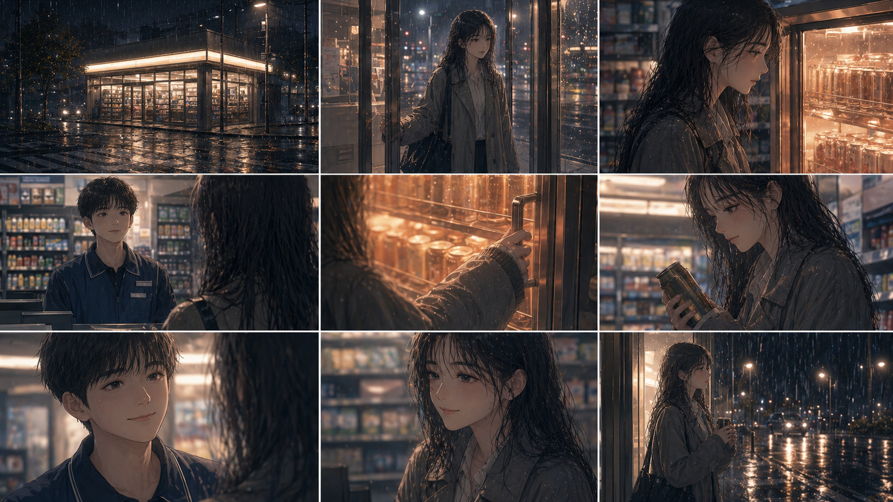
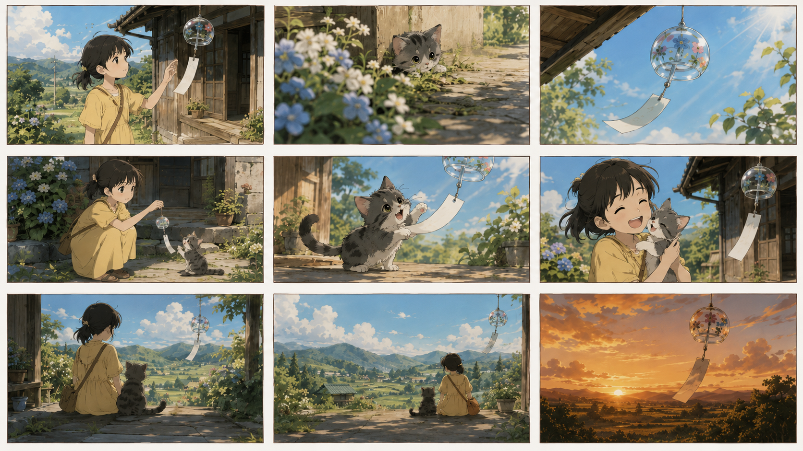
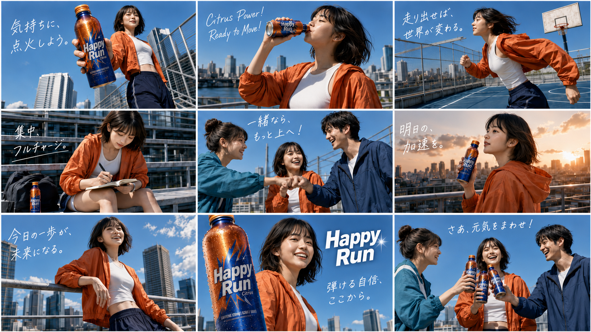
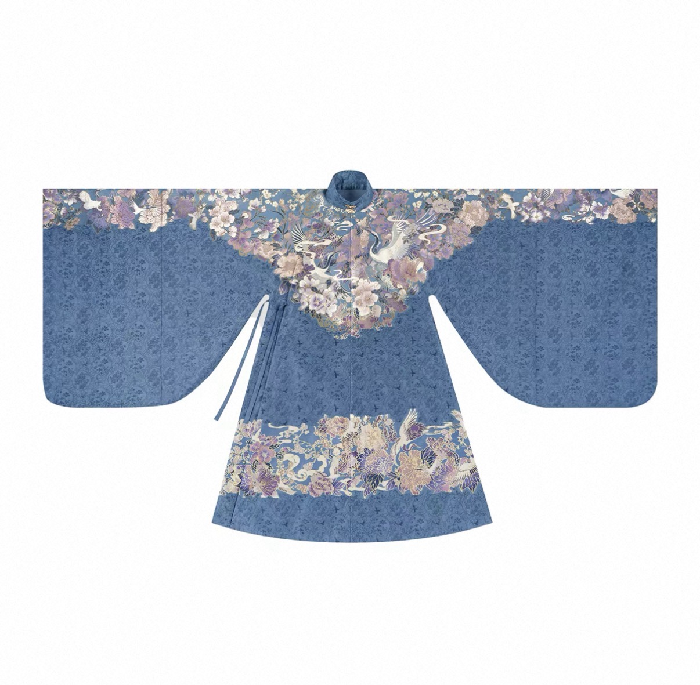

# Awesome HappyHorse Prompts

🌐 **语言：** 中文 · [🇬🇧 English](README.en.md)

<div align="center">


A curated collection of high-quality prompts, creative workflows, and usage guides for HappyHorse 1.0 & 1.1 video generation models.

HappyHorse 1.0 / 1.1 视频生成模型（文生视频 / 图生视频 / 参考生视频 / 视频编辑）的精选 Prompt 合集与创作指南。

[](https://www.happyhorse.com/)
<a href="https://bailian.console.aliyun.com/cn-beijing?tab=demohouse&source_channel=hhpromptrepo#/experience/t2v"></a>
[](https://github.com/modelstudioai/awesome-happyhorse-prompts/commits/main)

</div>

## 🌟 模型亮点速览

[HappyHorse 1.1](https://bailian.console.aliyun.com/cn-beijing?tab=model&source_channel=hhpromptrepo#/model-market/detail/happyhorse-1.1-t2v?serviceSite=asia-pacific-china) 是新一代视频生成大模型，在 1.0 基础上实现动态表现力、角色一致性、指令遵循、视觉质感与音频能力的全面升级，聚焦短剧制作、电商广告、品牌营销、游戏 CG 等内容生产场景。

- **动态表现力提升**：运动建模与帧间时序一致性优化，动作更连贯、力量感更强
- **多图参考一致性增强（R2V）**：支持多角色参考同屏不互相污染、角色与场景自由组合，分镜和九宫格故事板一致性大幅提升
- **长指令与复杂场景调度**：单条 Prompt 支持 6-8 个连续场景自动调度，多角色站位与空间关系更准确
- **视觉质感升级**：优化面部细节与真实肤质还原，面部大特写表现力显著提升
- **原生音视频协同**：音频生成升级为原生协同，台词语速停顿自然变化，背景音效受 Prompt 控制可关闭

## 📖 模型详情

| 模型名称 | 模型能力 | 输入输出 | 计费单价 |
|---------|---------|---------|---------|
| [happyhorse-1.1-i2v](https://bailian.console.aliyun.com/cn-beijing?tab=model&source_channel=hhpromptrepo#/model-market/detail/happyhorse-1.1-i2v?serviceSite=asia-pacific-china) | 以首帧图片为基础，支持通过文本描述进行引导，生成物理真实、运动流畅的视频。 | 图片 + 文字 → 视频 | 720P：¥0.9/秒；1080P：¥1.2/秒；免费额度：10s；**6.22 - 7.6 六折优惠** |
| [happyhorse-1.1-t2v](https://bailian.console.aliyun.com/cn-beijing?tab=model&source_channel=hhpromptrepo#/model-market/detail/happyhorse-1.1-t2v?serviceSite=asia-pacific-china) | 输入文本提示词生成物理真实、运动流畅的视频内容。 | 文字 → 视频 | 720P：¥0.9/秒；1080P：¥1.2/秒；免费额度：10s；**6.22 - 7.6 六折优惠** |
| [happyhorse-1.1-r2v](https://bailian.console.aliyun.com/cn-beijing?tab=model&source_channel=hhpromptrepo#/model-market/detail/happyhorse-1.1-r2v?serviceSite=asia-pacific-china) | 支持传入多张参考图像、九宫格故事板，通过文本提示词描述场景，将图像中的主体角色或根据分镜融合生成一段流畅的视频。 | 参考图片 + 文字 → 视频 | 720P：¥0.9/秒；1080P：¥1.2/秒；免费额度：10s；**6.22 - 7.6 六折优惠** |
| happyhorse-1.0-video-edit | 支持输入视频与参考图，结合文本指令完成风格变换、局部替换等编辑任务。 | 视频 + 文字（+ 参考图） → 视频 | 720P：¥0.9/秒；1080P：¥1.6/秒；免费额度：10s |

> 💡 HappyHorse 1.0 系列模型维持 **8 折** 折扣至 2026 年 7 月 6 日。
>
> ⚠️ 注：HappyHorse 原生支持中文（普通话）、英语、日语，更多语种支持中


## Contents

### HappyHorse 1.1

- [T2V 文生视频（1.1）](cases/t2v-1.1.md)
- [I2V 图生视频（1.1）](cases/i2v-1.1.md)
- [R2V 参考生视频（1.1）](cases/r2v-1.1.md)

### HappyHorse 1.0

- [T2V 文生视频](cases/t2v.md)
- [I2V 图生视频](cases/i2v.md)
- [R2V 参考生视频](cases/r2v.md)
- [Video Edit 视频编辑](cases/video-edit.md)
- [电商应用场景](cases/ecommerce.md)
- [API 参考](#api-参考)

---

## 🎬 HappyHorse 1.1 精选 Case Demo

### R2V 参考生视频（1.1）

> [Explore all 1.1 R2V Prompts →](cases/r2v-1.1.md)

**九宫格故事板一致性增强：** 上传 3×3 分镜图，模型按格顺序生成连贯镜头。

#### 便利店治愈夜 — 韩漫 3×3 故事板

**参考图：**

| 参考图 |
|:---:|
|  |

**Prompt:**
```
按照故事板序列生成视频。[Image1] 是一张 3x3 的故事板拼图。请严格按照从左到右、从上到下的顺序（左上→中上→右上→左中→中中→右中→左下→中下→右下），将每个格子视为视频的一个独立镜头，依次生成连贯序列。
【风格与氛围】韩漫电影感，温暖店内灯光与冷色雨夜对比，治愈、安静、微孤独。画面严禁出现任何文字。
【角色设定】女主：穿长外套的年轻女生，发丝微湿，疲惫但温柔。店员：清爽短发的便利店夜班少年。
【分镜指令】
格子1（左上）：全景，雨夜街角的便利店亮着暖白灯光。
格子2（中上）：中景，女主推门进店，肩带夜雨湿气。
格子3（右上）：近景，女主站在热饮柜前微微发呆。
格子4（左中）：中景，店员从收银台抬头看向她。
格子5（中中）：特写，热饮柜橙色暖光映在她手边。
格子6（右中）：近景，女主拿起热饮，神情放松。
格子7（左下）：近景，店员露出温和克制的微笑，说："오늘도 수고 많았어요."
格子8（中下）：中景，女主回以浅笑，疲惫感被冲淡。
格子9（右下）：收束镜头，女主捧着热饮站在店门外，背影被灯光映得温柔。
【生成要求】保持每张格子的构图与镜头语言，镜头运动平滑，在镜头间创建自然转场。角色特征与光影氛围全程一致。
```

**输出效果：**

**HappyHorse 1.1**

https://github.com/user-attachments/assets/12e1284b-89df-40e2-b539-9f8dabc3274e

**HappyHorse 1.0**

https://github.com/user-attachments/assets/245378f7-1096-4b70-86a9-8ac37bfcd471

---

#### 女孩与猫 — 日系动画电影感故事板

**参考图：**

| 参考图 |
|:---:|
|  |

**Prompt:**
```
按照故事板序列生成视频。[Image 1] 是一张 3x3 的故事板拼图。请严格按从左到右、从上到下的顺序，将每个格子视为视频的一个独立镜头，依次生成连贯序列。
【风格与氛围】日系动画电影感，夏日乡村、温暖阳光、清新治愈、安静怀旧。画面严禁出现任何文字或拼图网格线。
【角色设定】主角：穿浅黄色连衣裙的小女孩，黑色短发。配角：灰色虎斑小猫，圆眼好奇。核心道具：挂在日本乡村老屋檐下的透明玻璃风铃。
【分镜指令】格子1：女孩在木质门廊边发现风铃；格子2：花丛后小猫探头观察；格子3：风铃在蓝天下随风摇晃；格子4：女孩蹲下身把风铃放低给小猫看；格子5：小猫伸爪轻触风铃纸签；格子6：女孩开心地抱起小猫；格子7：女孩和小猫并肩坐在门廊上；格子8：大全景展现宁静夏日乡村；格子9：夕阳金光中的风铃轻摇收束。
【生成要求】保持每格构图与镜头语言，角色外貌与光影氛围全程一致，镜头运动柔和自然，整体像一支温柔的动画电影片段。
```

**输出效果：**

**HappyHorse 1.1**

https://github.com/user-attachments/assets/43a583b3-5e9e-4411-90f9-66e094cb7b4c

**HappyHorse 1.0**

https://github.com/user-attachments/assets/db952559-1271-4f06-8d68-3a6028683715

---

#### Happy Run Citrus — 日系青春汽水广告

**参考图：**

| 参考图 |
|:---:|
|  |

**Prompt:**
```
按照故事板序列生成一支日系青春汽水广告视频。[Image 1] 是一张 16:9 的 3x3 故事板拼图。请严格按照左上→中上→右上→左中→中中→右中→左下→中下→右下的顺序，将每个格子视为一个独立镜头，依次生成连贯广告片段。
【整体风格】日本夏日运动饮料广告风格，青春、清爽、阳光、积极、带一点日剧 CM 的热血感。写实真人广告质感，蓝天、城市天台、篮球场、河岸 skyline、橙色运动外套与蓝色饮料瓶形成强烈品牌色对比。
【角色与产品】女主：年轻日本女生，短发或中短发，穿橙色轻薄运动外套、白色短上衣、深蓝运动裤，气质清爽自信。产品为蓝橙配色的 Happy Run Citrus 能量汽水瓶，瓶身有冷凝水珠，阳光下闪光。
【分镜指令】格子1：城市天台女主递出饮料瓶；格子2：女主仰头喝 Happy Run；格子3：女主在天台篮球场奔跑；格子4：女主坐在户外长椅上专注学习；格子5：三人击拳互动；格子6：夕阳下女主望向城市；格子7：女主自信望向远方；格子8：品牌主视觉镜头；格子9：三人碰瓶开心大笑收束。
【生成要求】保持每格构图与人物位置关系，镜头间自然转场，角色脸部、服装、产品、蓝橙品牌色全程一致。写实高清广告片质感，不要多余文字和水印。
```

**输出效果：**

**HappyHorse 1.1**

https://github.com/user-attachments/assets/368387bc-138d-4b58-91f3-03c4fb11e429

**HappyHorse 1.0**

https://github.com/user-attachments/assets/2bbc2dd9-47f5-4fb3-a563-d2b6e60fe75e

---

### T2V 文生视频（1.1）

> [Explore all 1.1 T2V Prompts →](cases/t2v-1.1.md)

**长指令与复杂场景调度：** 单条 Prompt 描述 6-8 个连续场景，模型自动分配镜头。

#### 教室纯爱暧昧 — 日式青春短片

**Prompt:**
```
15秒电影级日式纯爱暧昧短片，超写实画质。午后空教室暖金色阳光透过百叶窗洒在并排课桌上...
```

**输出效果：**

**HappyHorse 1.1**

https://github.com/user-attachments/assets/dfe29214-c823-446d-a732-58cc64af37b1

**HappyHorse 1.0**

https://github.com/user-attachments/assets/1bfdb3d3-6c08-466f-bdfb-1d980b4a4280

---

### I2V 图生视频（1.1）

> [Explore all 1.1 I2V Prompts →](cases/i2v-1.1.md)

**动作连贯性与视觉质感升级：** 首帧引导 + 极简动作描述，生成更流畅的动态。

#### 竹林对决 — 水墨武侠风

**首帧参考：**

| 首帧参考 |
|:---:|
|  |

**Prompt:**
```
Wind surges through the bamboo forest. The white-robed swordswoman leaps onto bamboo tips...
```

**输出效果：**

**HappyHorse 1.1**

https://github.com/user-attachments/assets/c93c9a2c-2228-44aa-91dd-37db35ff8d1e

**HappyHorse 1.0**

https://github.com/user-attachments/assets/9d467975-4663-458f-8668-e134b519b428

---

## 🎬 HappyHorse 1.0 精选 Case Demo

### T2V 文生视频

> **11 curated cases** — [Explore all T2V Prompts →](cases/t2v.md)

**提示词公式：** 提示词 = 场景 + 主体 + 运动 + 音频

| 场景 | 主体是视频内容的主要表现对象，可以是人、动物、植物、物品或非物理真实存在的想象物体。 |
| 运动 | 运动包含主体的具体运动和非主体的运动状态，可以是静止、小幅度运动、大幅度运动、局部运动或整体动势。 |

---

### Case 1: 古风玄幻 — 白发少女与龙

**Prompt:**
```
动漫风格，国风2d风格，类似玄机科技的画风白发少女，扎发，冷白皮肤，兼具冷艳系长相，画面有颗粒感。 丹凤眼，闭眼姿态，表情慵懒平静，举止端庄，极致细节，极致厚涂，琉璃质感，流线笔刷。白色披着的头发，身着藏蓝色绒翎长袍，衣服的元素带有少数民族元素，整体有柔光、质感，氛围梦幻朦胧，低饱和度，富有反差故事感。头上簪着一支蓝色翡翠或者水晶垂吊簪，既显温婉又不失贵气，契合角色气质形象。 正脸示人，轻笑一声，语气轻柔又不屑说完＂哦？要抓我？＂ 之后，缓缓抬眼，眼中闪炸开一丝微乎其微的光，瞬间镜头从她脸前拉远，身后瞬间乌云密布电闪雷鸣，一条水龙从天而降咆哮龙吟一声，极速飞至她头顶，霸气盘立上空，眼中红光乍现，震耳的嗡鸣声滚滚响起。
```

**输出效果：**

https://github.com/user-attachments/assets/14e66750-7f22-4990-9d40-5f833caac0f9

---

### Case 2: 新海诚风格星空少女

**Prompt:**
```
全景，新海诚风格，时间为盛夏的夜晚，地点是远离尘嚣的宁静小镇边缘山坡。晴朗无云，繁星密布如同璀璨宝石镶嵌于天幕，银河横跨天际，散发着幽蓝深邃的光晕。月光如银纱般轻柔地洒在翠绿的山坡草坪上，使其染上一层淡淡的冷白色。一位身着淡蓝色连衣裙的少女静立于此，微风吹拂着及肩的棕色长发，发丝在月光下泛着柔和的暖棕色光泽。她双手交叠放在身前，抬头仰望着星空，眼中满是对浩瀚宇宙的憧憬和淡淡的孤独。周围萤火虫提着绿幽幽的光在草丛中飞舞，像是在安慰少女的寂寞。山坡上五颜六色的野花在星月光辉与萤火虫光亮交织的光影中轻轻摇曳，画面主色调为蓝紫冷色调，点缀着暖黄的萤火虫光与少女裙装的淡蓝。镜头从夜空缓缓向下移动至少女，带着一种静谧又略带忧伤的氛围。
```

**输出效果：**

https://github.com/user-attachments/assets/20b4d5f7-e0ef-452e-99d5-b16693016f26

---

### I2V 图生视频（首帧）

> **7 curated cases** — [Explore all I2V Prompts →](cases/i2v.md)

**适用场景：**
- 有一张满意的设计稿或插画，想让它"动起来"
- 需要精确控制视频的开场画面
- 基于产品图、人像照等现有素材快速生成动态展示

**书写建议：** 提示词中重点描述"动起来之后发生什么"——动作、运动轨迹、镜头变化等。无需重复描述图片中已有的静态内容，模型会自动识别首帧画面信息。

---

### Case 1: 古风对话 — 王爷与丫头

**首帧参考：**

| 首帧参考 1 | 首帧参考 2 |
|:---:|:---:|
|  |  |

**Prompt:**
```
分镜 1 (生成 4s)
王爷端坐执卷，丫头从旁侧凑近歪头看他。一个清脆俏皮的女声问：王爷不近女色？一个低沉冷淡的男声回：嗯。暖光透过窗棂，书房雅致。固定机位。

分镜 2 (生成 4s)
丫头指尖轻点王爷脸颊，歪头笑。王爷睫毛微颤，执卷手指收紧，仍垂眸看书。俏皮女声：那我呢？男声停顿后：……你也不行。镜头微推。
```

**输出效果：**

https://github.com/user-attachments/assets/06da22b8-8e47-4233-b6a8-fed2268fb2cc

---

### R2V 参考生视频（支持图片输入）

> **5 curated cases** — [Explore all R2V Prompts →](cases/r2v.md)

**适用场景：**
- 需要保持角色在不同镜头中外观一致，提供同一角色的多角度照片作为参考
- 有明确的场景设定或美术风格板，希望视频还原特定的视觉风格
- 按照分镜脚本制作视频，将各分镜图依次上传引导生成
- 需要将多个元素（如角色＋场景+Logo）组合到同一段视频中

---

### Case 1: 宠物主播脱口秀

**参考图：**

| 参考图 1 | 参考图 2 | 参考图 3 |
|:---:|:---:|:---:|
|  |  |  |

**Prompt:**
```
一张超逼真的4K摄影级画面，场景设定为潮流感满满的播客录音间。背景为蓝灰色几何拼接声学泡沫墙，两侧专业补光灯从侧前方柔和打亮主体，阴影过渡自然无塑料感。构图采用对称式双人中景，视觉重心稳定于深色实木直播桌后方。桌面摆放两只印有宠物爪印图案的陶瓷咖啡杯，整体氛围拟人化、网感十足，毛发纹理根根分明，材质反射符合物理光学规律。画面左侧是一只戴着潮酷黑框墨镜、挂着金色项链的橘白英短猫，端坐在复古做旧皮质主播椅上，面前摆着黑色专业麦克风，前爪自然交叠搭在桌沿，表情拽酷又带点傲娇。画面右侧是一只戴着街头风棒球帽、耳朵上别着银色耳钉的棕色柴犬，同样坐于同款主播椅，正对着麦克风咧嘴笑，露出治愈系犬齿。双宠手肘均轻搭桌面，形成稳定的双人主播站位，镜头焦点锐利锁定面部与麦克风区域。
基于此高精度底图进行动态口型驱动与表演设计：身份定位为宠物界"吐槽搭子"，对话主题围绕《铲屎官那些"自我感动"的迷惑行为》展开。角色人设与情绪分配明确：猫（橘白英短）担任毒舌吐槽役，语速稍快，情绪带着不屑与嘲讽；狗（柴犬）担任呆萌提问役，语速适中，情绪充满疑惑与好奇。
```

**输出效果：**

https://github.com/user-attachments/assets/a20adca0-bf45-4cae-b933-c98b86eac8d0

---

### Video Edit 视频编辑（风格转换/元素替换）

> **6 curated cases** — [Explore all Video Edit Prompts →](cases/video-edit.md)

**适用场景：**
- 对视频整体风格不满意，想转换画面氛围（如写实转动漫、白天转黄昏）
- 需要修改画面中的局部元素（如替换背景、改变服装颜色、添加天气特效）
- 有一张目标风格的参考图，希望视频整体视觉效果向其靠拢
- 对AI生成的视频做二次修正，微调动作或画面细节

---

### Case 1: 古风服装替换

**参考图：**

| 参考图 |
|:---:|
|  |

**输入视频：**

https://github.com/user-attachments/assets/a43226c7-9592-4943-911d-8f88ae0f39cb

**Prompt:**
```
参考 Image 1，将视频中女主的衣服替换为图中所示的雾霾蓝明制汉服。汉服必须完全贴合女主的身形轮廓和动作姿态，宽大的袖子需跟随她的手臂运动自然摆动，立领和衣襟的层次感要随身体转动合理呈现。仙鹤与花卉刺绣的图案位置、比例和细节必须严格参照 Image 1，刺绣表面的光泽、阴影和材质质感必须与原视频环境的光源保持一致。在此过程中，女主的面部表情、发型、肤色、背景环境以及镜头的运镜轨迹必须保持 100% 不变。
```

**输出效果：**

https://github.com/user-attachments/assets/630e2fdf-e069-4e2c-9392-d0217d8b0ade

---

### 🐴 电商应用场景

> **2 curated cases** — [Explore all E-commerce Prompts →](cases/ecommerce.md)

---

### Case 1: 古装爽剧带货 — 香水瓶植入

**参考图 + Prompt:**
```
参考「图片1」中的王爷形象与「图片2」中的丫头形象，两人在古风书房暖光场景中互动。王爷端坐案前执卷看书，神情清冷疏离。丫头身着浅绿纱衣从旁侧凑近，歪头凝视王爷侧脸，指尖轻点自己颈侧，眼神试探又带俏皮。丫头清脆问：王爷不近女色？王爷冷淡回：嗯。丫头笑：那这香气呢？案几一角放着「图片3」中的精致琥珀色香水瓶，红色圆顶瓶盖，瓶身隐约可见 QWEN 字样，在暖光下微微反光。固定机位，真人古风写真风格，电影级光影质感，面部细节清晰。
```

---

## 💻 API 参考

**模型调用地址：**
- 北京：`POST https://dashscope.aliyuncs.com/api/v1/services/aigc/video-generation/video-synthesis`
- 新加坡：`POST https://dashscope-intl.aliyuncs.com/api/v1/services/aigc/video-generation/video-synthesis`

**立刻体验模型：**
- 国内：[百炼控制台 - HappyHouse 体验中心](https://bailian.console.aliyun.com/cn-beijing?tab=demohouse&source_channel=hhpromptrepo#/experience/t2v)
- 国际：[ModelStudio Console](https://modelstudio.console.alibabacloud.com/ap-southeast-1?tab=dashboard&source_channel=HHpromptRe#/efm/model_experience_center/vision/videoGenerate)

**Prompt 创作指南：**
- 仓库内置 Skill：[happyhorse-prompt-craft-SKILL.md](happyhorse-prompt-craft-SKILL.md) —— HappyHorse 1.0/1.1 R2V/I2V/T2V prompt 创作与优化实战指南

---

## 🤝 Contributing

欢迎提交 Pull Request 分享你的 HappyHorse 创意 Prompt！

请确保：
- Prompt 内容原创或已获授权
- 附上使用的模型名称和参数设置
- 提供生成效果的简要描述

## 📄 License

[CC BY 4.0](LICENSE)
