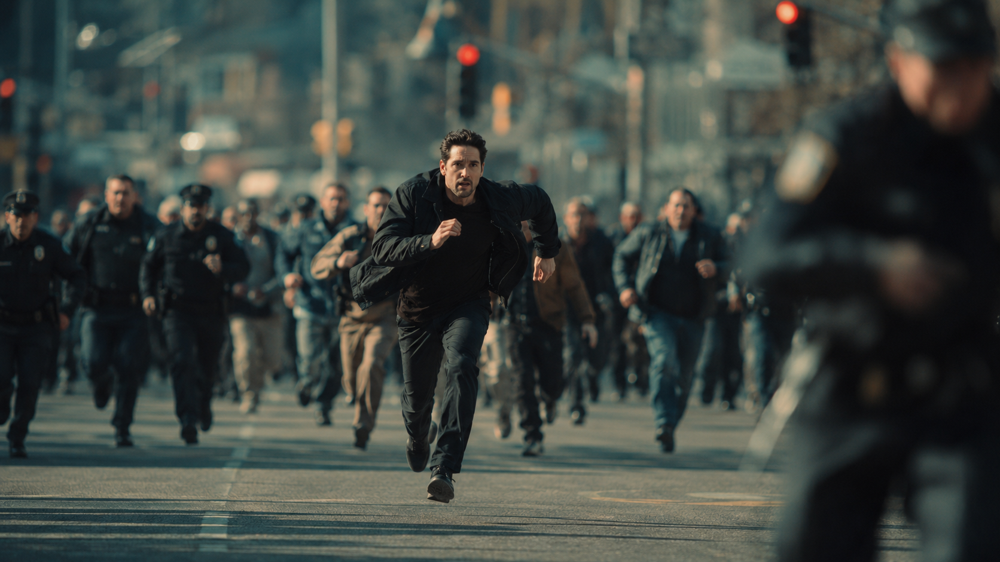

# I2V Image-to-Video Cases (HappyHorse 1.1)

🌐 **Language:** English · [🇨🇳 中文](i2v-1.1.md)

> HappyHorse 1.1 I2V markedly improves motion modeling and inter-frame temporal consistency, delivering more coherent and forceful action than 1.0 — fixing the slow / under-fluid motion that 1.0 occasionally produced. The visual layer also gets a quality upgrade: less facial gloss, less over-sharpening, and more natural textures.

**When to use:**
- You have a first frame and need the model to generate subsequent action and camera movement
- High-impact action scenes such as combat or chases
- Extending a static concept frame into a moving shot

---

### Case 1: Runaway man — chase and collision

**Model:** `happyhorse-1.1-i2v`

> **Prompt intent (EN annotation):** A short, action-dense single-paragraph prompt — under 60 Chinese characters, fully focused on motion, camera and SFX (per the 30–60-character optimum recommended at the bottom of this file). Levers worth tuning: the camera language stack (`镜头快速横摇跟随他冲过画面` then `转为侧面跟拍`), the prop-collision beat (knocks over a fruit stall, fruit scatters), the recovery + alley dash, the over-the-shoulder fearful glance, and the layered audio cue (`追赶脚步声、碰撞巨响和人群慌乱喊叫`). Notice no wardrobe or appearance description — frame 1 already carries that.

**Prompt (verbatim):**
```
男子迎面飞奔而来，镜头快速横摇跟随他冲过画面转为侧面跟拍，他撞倒路边水果摊，水果四散滚落，踉跄爬起穿过窄巷继续狂奔，回头惊恐一瞥后加速消失。追赶脚步声、碰撞巨响和人群慌乱喊叫。
```

**Input image:**



**Outputs:**

**HappyHorse 1.1**

https://github.com/user-attachments/assets/8923260a-fdaf-4cee-b583-26205fb3d760

**HappyHorse 1.0**

https://github.com/user-attachments/assets/9cc0323e-a89f-4718-a5d6-36aae54916fa

---

### Case 2: Bamboo-forest duel — ink-wash wuxia

**Model:** `happyhorse-1.1-i2v`

> **Prompt intent (EN annotation):** Fully English wuxia prompt anchored to an ink-wash aesthetic. Levers: the style lock (`ink-wash animation style maintained throughout, no color shift`), the inventive replacement of conventional combat sparks with ink ripples (`ink-wash energy ripples outward instead of sparks`), the choreographic arc (leap onto bamboo tips → midair spin dodge → leaves erupt → overhead reveal → freeze on the throat thrust), and the silence-at-the-end audio bookend. A clean reference for stylized action set-pieces.

**Prompt (verbatim):**
```
Wind surges through the bamboo forest. The white-robed swordswoman leaps onto bamboo tips, robes billowing like crane wings. A black-clad assassin bursts from the shadows — blades clash, ink-wash energy ripples outward instead of sparks. Rapid exchange: she spins midair dodging strikes, severed bamboo stalks tumble in slow motion. Bamboo leaves erupt upward like black rain as their fight intensifies. Camera pulls up to overhead view — white figure surrounded by dark silhouettes. Final thrust: her sword stops at the assassin's throat, everything freezes, leaves drift down slowly.Erta ink-wash animation style maintained throughout, no color shift. Sound: bamboo rustling, blade clashes, wind gusts, silence at the end.
```

**Input image:**


**Outputs:**

**HappyHorse 1.1**

https://github.com/user-attachments/assets/c93c9a2c-2228-44aa-91dd-37db35ff8d1e

**HappyHorse 1.0**

https://github.com/user-attachments/assets/9d467975-4663-458f-8668-e134b519b428

---

## I2V 1.1 authoring tips

- Frame 1 already carries appearance information — don't restate wardrobe / look / background in the prompt.
- 30–60 characters is the sweet spot. Concentrate on motion + camera move + SFX.
- For complex combat scenes, you can stretch to ~720 characters.
- Append an audio description at the end for sync-locked picture + sound.
