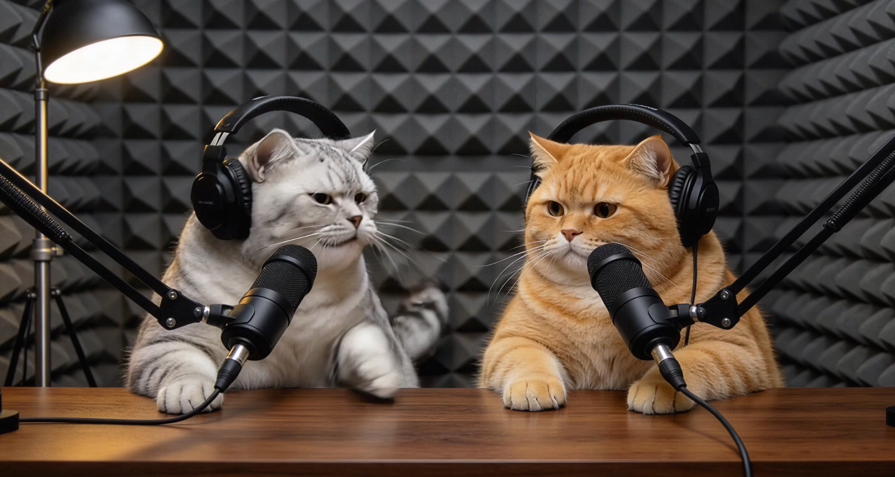
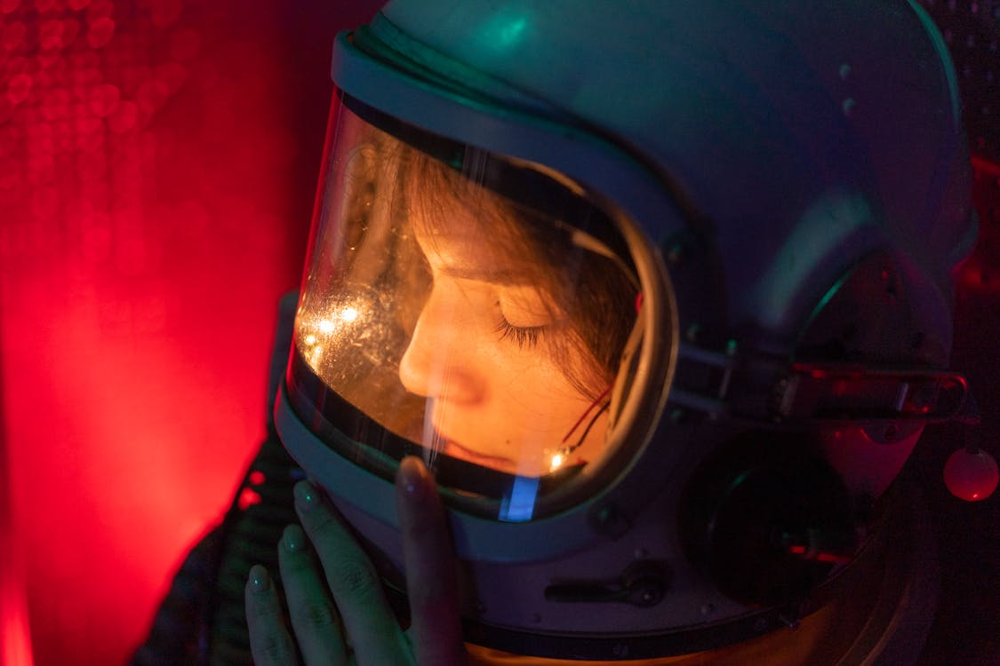
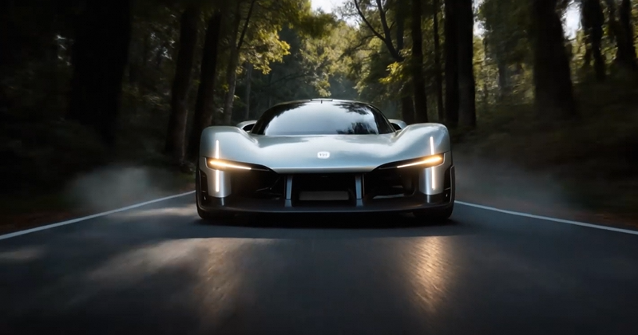
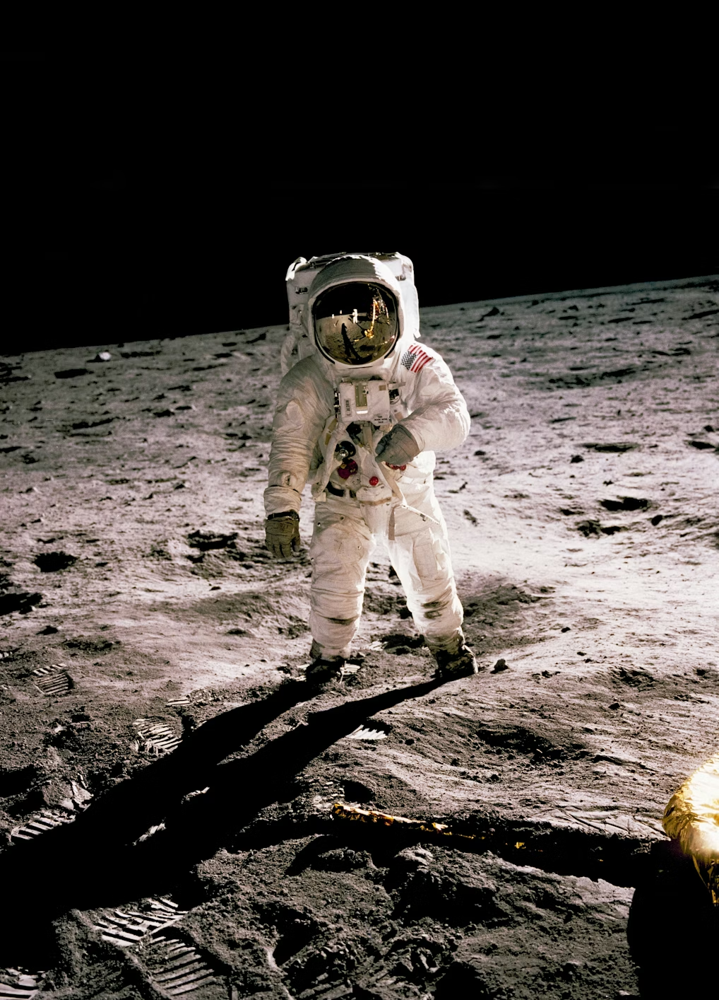
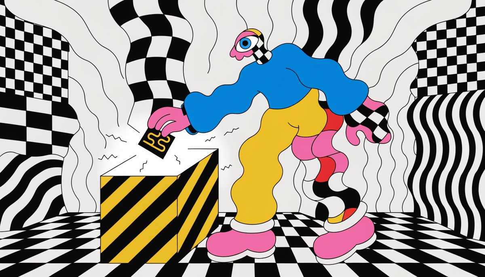
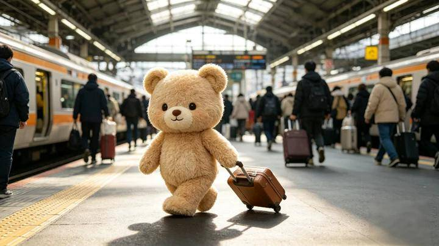

# I2V Image-to-Video (First-Frame) Cases

🌐 **Language:** English · [🇨🇳 中文](i2v.md)

> Use a single image as the video's opening frame. The model generates the subsequent motion from that frame. Whatever you upload becomes frame 1 — guaranteeing the video's starting visual matches your intent exactly.

**When to use:**
- You already have a finished design or illustration and want to "make it move"
- You need precise control over the opening shot
- You want to animate existing assets like product shots or portraits

**Authoring tip:** Focus the prompt on what happens *after* frame 1 — actions, motion paths, camera moves. Don't re-describe static content already in the image; the model reads frame 1 automatically.

---

### Case 1: Period-drama dialogue storyboard — Prince and the maid

**Model:** `happyhorse-1.0-i2v`

> **Prompt intent (EN annotation):** Two-shot storyboard pattern (`分镜 1 / 分镜 2`), 4 seconds each. The dialogue is the dramatic spine — the verbatim Chinese lines `王爷不近女色？` / `嗯。` / `那我呢？` / `……你也不行。` carry the playful-vs.-stoic register that defines the scene. Levers: per-shot duration declaration (`生成 4s`), camera lock for the first beat (`固定机位`) versus the slow push for the punchline (`镜头微推`), and the speaker tags (`清脆俏皮的女声` / `低沉冷淡的男声`) which the model treats as voice-direction.

**Prompt (verbatim):**
```
分镜 1 (生成 4s)
王爷端坐执卷，丫头从旁侧凑近歪头看他。一个清脆俏皮的女声问：王爷不近女色？一个低沉冷淡的男声回：嗯。暖光透过窗棂，书房雅致。固定机位。

分镜 2 (生成 4s)
丫头指尖轻点王爷脸颊，歪头笑。王爷睫毛微颤，执卷手指收紧，仍垂眸看书。俏皮女声：那我呢？男声停顿后：……你也不行。镜头微推。
```

**Input images:**


**Output:**

https://github.com/user-attachments/assets/06da22b8-8e47-4233-b6a8-fed2268fb2cc

---

### Case 2: Cat livestream stand-up

**Model:** `happyhorse-1.0-i2v`

> **Prompt intent (EN annotation):** Two anthropomorphized cats trading roast lines, set up as a livestream comedy bit. Levers: voice-direction tag (`使用台湾中年男腔调` — Taiwanese middle-aged man accent), explicit segment timecodes `【1-5秒】` / `【5-10秒】`, per-line speaker assignment (silver cat vs. golden cat) so the model knows which cat moves its mouth, the comedic finale (`最后2只猫一起哈哈哈哈哈大笑起来`), and the lip-sync rule (`动作表情跟对话内容要严丝合缝`). Lines kept verbatim because the comedy only works in the source language register.

**Prompt (verbatim):**
```
直播间里，两只猫咪以拟人化形象做搞笑对话，要求写实，使用台湾中年男腔调。银色猫先说话：台词"他说他要当网红"。【1-5秒】画面：银色猫扭头面向金色猫，身子站立，伸着一只前爪，尾巴摇动，动作自然。金色猫说话：台词"靠什么火？"。【5-10秒】画面：金色猫扭头看向银色猫后身子站立，伸着一只爪子，满脸不屑的表情，动作自然。银色猫说话：台词"拍我们"金色猫说话：台词"那火的是我们，关他什么事"银色猫说话：台词"他说他负责帅"金色猫说话：台词"帅在哪？"银色猫说话：台词"帅在不出镜"要求语速适中，不要抢话，最后2只猫一起哈哈哈哈哈大笑起来，笑声洪亮，动作表情跟对话内容要严丝合缝。
```

**Input image:**



**Output:**

https://github.com/user-attachments/assets/c1229f97-8d1f-4682-ad71-7249ca4bf0e2

---

### Case 3: Astronaut capsule — four-shot inner monologue

**Model:** `happyhorse-1.0-i2v`

> **Prompt intent (EN annotation):** Four explicitly time-coded shots (`【镜头一 · 0–4秒】` … `【镜头四 · 12–15秒】`) building from extreme close-up to wide shot. No spoken dialogue — the storytelling is all camera + light + micro-expression. Levers: the color-treatment closer (`深红预警 × 冷蓝深空 × 琥珀肤光`), the breath-paced camera direction (`镜头如呼吸般起伏`), the cross-shot motif of the visor reflection, and the closing audio cue (`一声极其微弱的、像心跳又像信号的电子脉冲声`). Excellent template for any contemplative one-character piece.

**Prompt (verbatim):**
```
【镜头一 · 0–4秒】 画面从头盔玻璃面罩内侧的水雾与光斑缓缓对焦——那些光点像是遥远星系的残影，或是某种正在消逝的记忆。红色警报光在她脸上有节律地扫过，将她的皮肤染成深红与暗影交替的律动。她的眼睛紧闭，睫毛轻轻颤动，像是在黑暗中接收某种只有她能听见的频率。镜头以极慢速度贴近面罩玻璃，试图穿透那层透明的屏障。
【镜头二 · 4–8秒】 她缓缓睁开眼睛。但眼神不是向外看的——而是向内，像是在看自己内心某个正在坍塌或重建的宇宙。镜头切入面罩玻璃表面的反射：在那层玻璃的倒影里，出现了一片星空——不是这个舱室，而是某个遥远的、她曾经见过或梦见过的地方。红色光芒突然增强，她的手抬起，指尖触碰面罩——从外侧，像是有另一只手在回应。
【镜头三 · 8–12秒】 快切至极近景：她的眼睛里，星空的倒影在瞳孔中燃烧。镜头缓慢旋转，像一颗卫星在她的轨道上运行。面罩玻璃上的水雾开始在红光中蒸发，露出她脸上细微的表情变化——不是恐惧，是某种比恐惧更深的东西：认命，或者，领悟。
【镜头四 · 12–15秒】 镜头骤然拉远，穿越面罩玻璃向外——她的整个头盔变成画面中一个渺小的球体，背景中红色警报光渐渐熄灭，取而代之的是一片深邃的、无边的蓝黑色静默。她的手慢慢放下。画面在这片静默中切黑——只留下一声极其微弱的、像心跳又像信号的电子脉冲声。
色调：深红预警 × 冷蓝深空 × 琥珀肤光。镜头如呼吸般起伏，克制而充满张力。
```

**Input image:**



**Output:**

https://github.com/user-attachments/assets/ec1974ca-c251-43d2-9a05-bf7e51b58fb9

---

### Case 4: Sports car on a country road — dynamic camera

**Model:** `happyhorse-1.0-i2v`

> **Prompt intent (EN annotation):** Two-shot car commercial pattern using `镜头1` / `镜头2` block tags. Levers: shot-1 angle (`高空垂直俯视镜头`) with the S-curve road and tree-tunnel effect; shot-2 sync-tracking with the car (`镜头和跑车保持同步移动`) plus the trail effects (light trails from the headlights, motion blur on either side, stable wheel rotation). A clean, reusable two-beat structure for any vehicle hero piece.

**Prompt (verbatim):**
```
镜头1：高空垂直俯视镜头，银色跑车在S形乡间道路匀速前进，车身线条反射环境光形成流动光带，轮胎与路面接触处扬起薄雾状尘埃，道路两侧树木形成绿色隧道效果
镜头2：镜头和跑车保持同步移动，车头占据画面中心位置，前灯光线在运动中形成光轨，进气格栅细节清晰可见，轮胎转动时轮毂保持稳定旋转，两侧景物形成运动模糊
```

**Input image:**



**Output:**

https://github.com/user-attachments/assets/f121c9c1-b5c5-4dbf-8a1e-0b6280d2ccf8

---

### Case 5: Astronaut moonwalk — visor-reflection cinematography

**Model:** `happyhorse-1.0-i2v`

> **Prompt intent (EN annotation):** Fully English prose-form prompt — no segment tags, no per-shot block markers, just a single lyrical paragraph that the model parses into shot transitions ("slowly pushes in" → "eases back" → "dives low" → "pulls back and upward"). Useful when the visual rhythm is more important than precise timecodes. Levers: the unifying motif (the gold visor reflection of the lunar module), low-gravity dust physics (`ultra-slow motion`, `each particle catching sunlight like scattered golden sparks`), and the closer (`cold and sacred in tone, with subtle handheld camera tremors`).

**Prompt (verbatim):**
```
The camera slowly pushes into the astronaut's reflective gold visor, where a miniature world is revealed — the lunar surface and the distant lunar module reflected in breathtaking clarity, like a universe trapped within glass. The camera then eases back as the astronaut takes a single slow, weighted step forward, lunar dust rising in ultra-slow motion under low gravity, each particle catching sunlight like scattered golden sparks. The camera dives low to capture the deep bootprint pressed into the regolith — a mark of history carved into silence. Finally, the shot pulls back and upward to reveal the astronaut's full silhouette against the infinite black cosmos, with a faint blue glow of Earth hovering in the far distance. The entire sequence carries a cinematic film-grain aesthetic, cold and sacred in tone, with subtle handheld camera tremors evoking the rawness of authentic documentary footage.
```

**Input image:**



**Output:**

https://github.com/user-attachments/assets/436e93a6-d7b0-4ff3-b50a-348011c157fd

---

### Case 6: Abstract cartoon — psychedelic rhythm

**Model:** `happyhorse-1.0-i2v`

> **Prompt intent (EN annotation):** Pure motion + texture choreography for a stylized 2D scene. Levers: the rhythmic-distortion phrasing (`slowly ripple and distort rhythmically`, `pulses with a psychedelic rhythmic energy`), the layered actions (background warps, character sways, card insertion, electric sparks at the slot, single eye rotating), and a gentle camera oscillation on top. Demonstrates that very short prompts work fine for stylized loops.

**Prompt (verbatim):**
```
The black and white wavy lines and checkered patterns in the background slowly ripple and distort rhythmically, the blue cartoon character sways slightly along with the motion, slowly inserting the card into the yellow and black striped box, electric sparks flicker at the slot of the box, the single eye rotates and looks around, the whole scene pulses with a psychedelic rhythmic energy, camera gently sways left and right.
```

**Input image:**



**Output:**

https://github.com/user-attachments/assets/9a65974a-4b32-48d1-9ed1-b986d859f583

---

### Case 7: Teddy bear rushing through the train station

**Model:** `happyhorse-1.0-i2v`

> **Prompt intent (EN annotation):** Single-shot lip-synced character action. Levers: the explicit lip-sync directive (`The bear's mouth moves in perfect lip-sync as it hurriedly says`), the verbatim spoken English line "There's no time left, I'm going to be late!", the supporting expression cue (`anxious and determined`), the ambient background callout (other passengers and trains with subtle natural movement), and the camera spec (`smooth forward tracking shot`) plus material/light continuity with frame 1 (`maintaining its soft, fuzzy texture and the realistic cinematic lighting from the original image`).

**Prompt (verbatim):**
```
The cute teddy bear as it briskly walks forward across the train station platform, pulling its brown suitcase behind it with a sense of urgency. The bear's mouth moves in perfect lip-sync as it hurriedly says: 'There's no time left, I'm going to be late!' Its expression should appear anxious and determined. In the background, other passengers and the trains should have subtle, natural movements to reflect a busy station atmosphere. The camera follows the bear with a smooth forward tracking shot, maintaining its soft, fuzzy texture and the realistic cinematic lighting from the original image.
```

**Input image:**



**Output:**

https://github.com/user-attachments/assets/1028b55e-f125-4514-ad71-f2b4173010d9

---

### Case 8: Cartoon-to-live-action transition

**Model:** `happyhorse-1.0-i2v`

> **Prompt intent (EN annotation):** A two-line stress test — the brief tells the model both the action (a graceful spin) and the *style transition* mid-shot (cartoon → live-action). Levers: the spin as the diegetic motivator for the transition (`As she spins around in a full turn`), and the seamlessness directive (`seamlessly transforms`). Useful template for any in-shot art-style swap.

**Prompt (verbatim):**
```
A girl is dancing gracefully. As she spins around in a full turn, the entire scene seamlessly transforms from a cartoon style into a realistic live-action setting.
```

**Input image:**


**Output:**

https://github.com/user-attachments/assets/15729db3-2531-4191-8c38-eadad2b0dd2b
