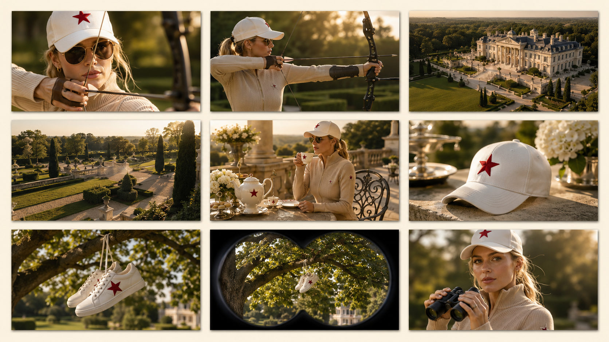
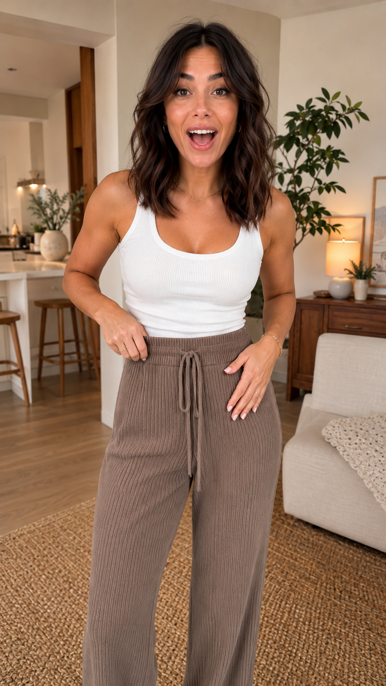
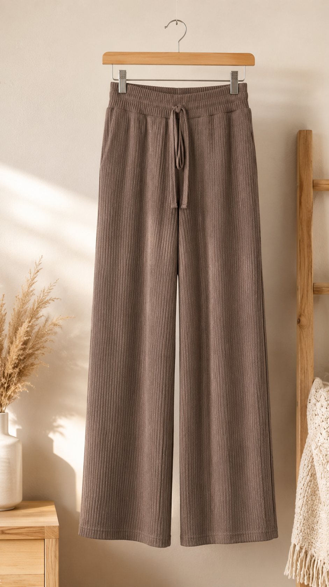
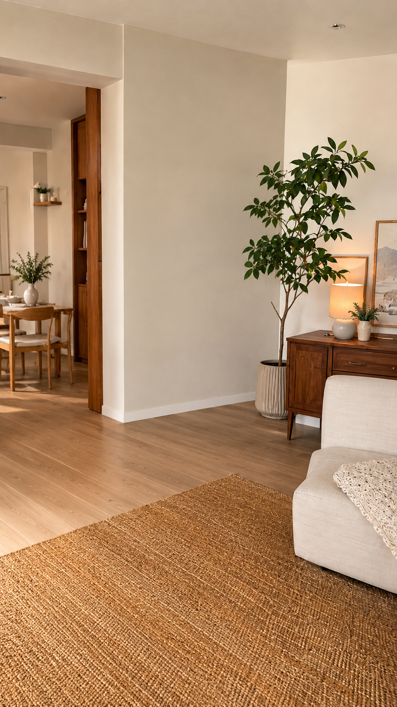
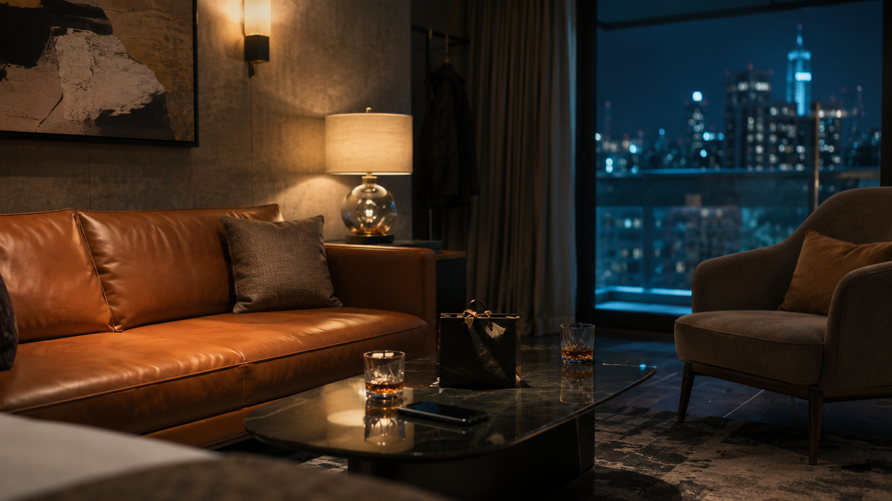
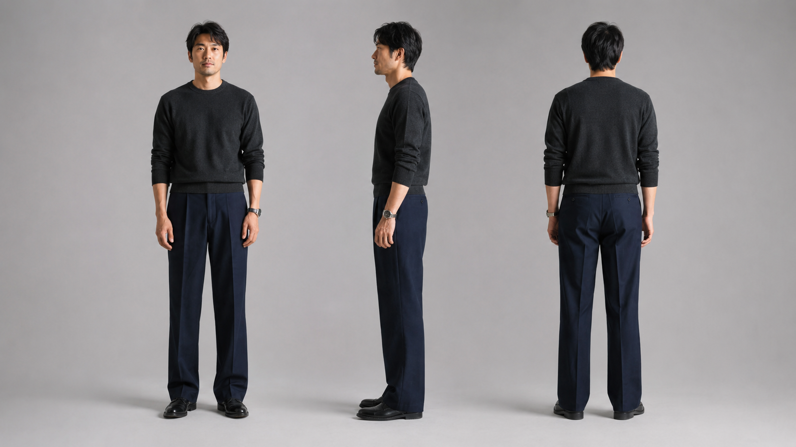
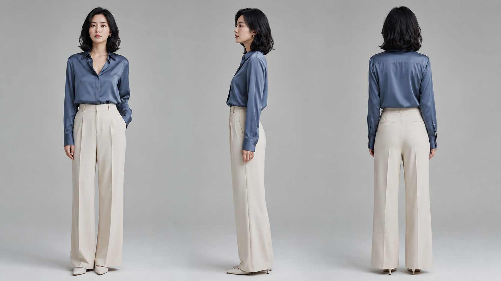
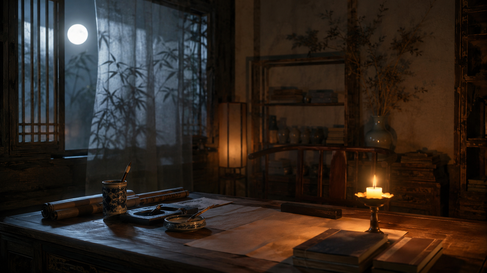
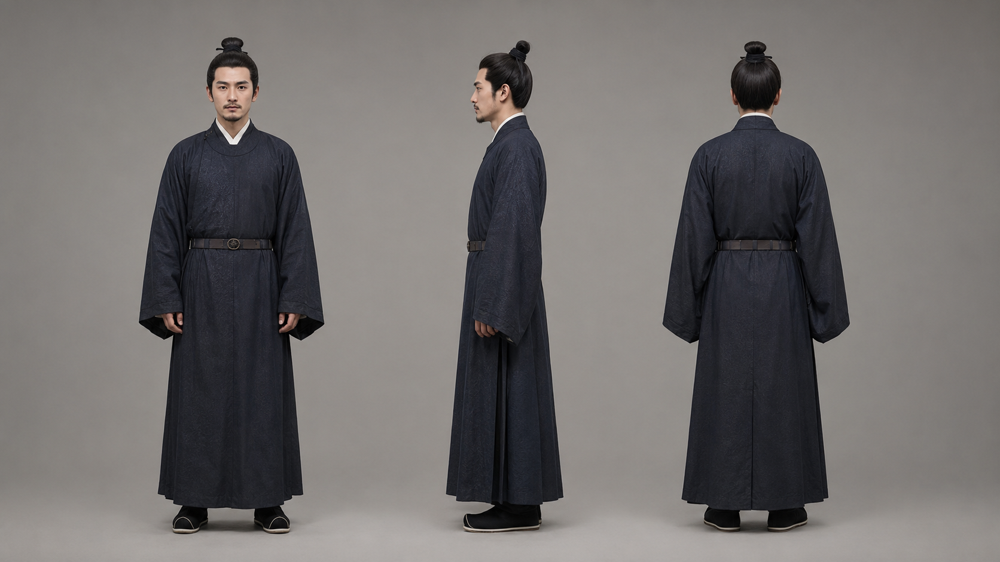
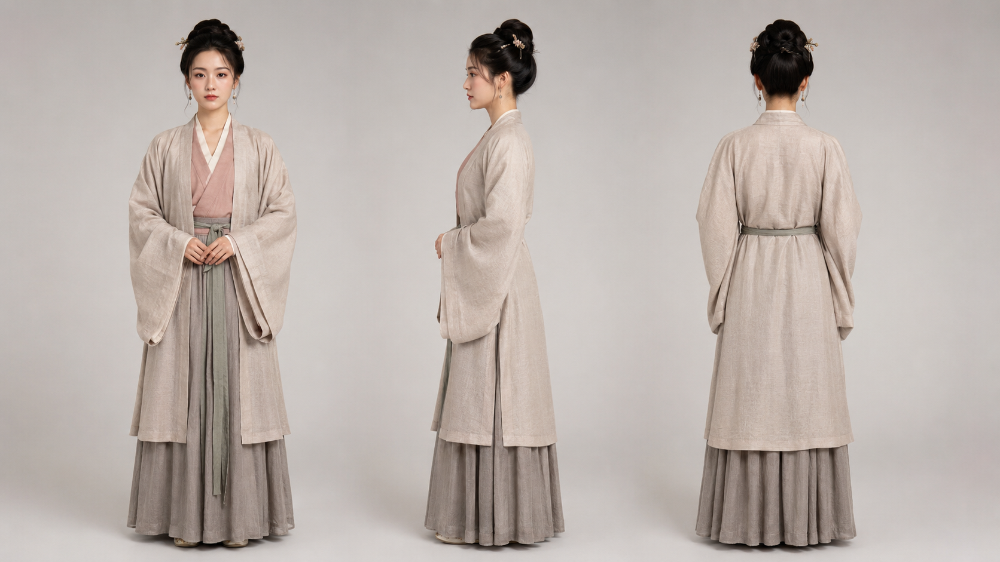

# R2V 参考生视频案例（HappyHorse 1.1）

> HappyHorse 1.1 R2V 大幅强化了参考图注意力机制，支持九宫格故事板、多角色参考同屏不互扰、角色参考与场景参考分离输入。单条 Prompt 可描述 6-8 个连续场景，模型自动调度镜头并保持角色一致性。

**适用场景：**
- 按 3×3 故事板逐格生成连贯广告 / 动画 / 短剧片段
- 多角色同框，保持各角色外貌、服装、气质一致
- 场景与角色分离参考，实现同一角色在不同场景间切换
- 电商直播、品牌广告等需要固定产品/人物形象的生成任务

**提示词参考示例：**
- `[Image 1]` 为 3×3 故事板参考，请严格按照左上→中上→右上→左中→中中→右中→左下→中下→右下顺序生成连贯镜头
- `[Image 1]` 为场景参考，`[Image 2]` 为男人参考，`[Image 3]` 为女人参考，生成酒店套房夜景对话短剧
- `[Image 1]` 为开场直播画面，`[Image 2]` 为试穿效果，`[Image 3]` 为产品平铺，`[Image 4]` 为家居场景

---

### Case 1: 便利店治愈夜 — 韩漫 3×3 故事板

**模型:** `happyhorse-1.1-r2v`

**Prompt:**
```
按照故事板序列生成视频。[Image1] 是一张 3x3 的故事板拼图。请严格按照从左到右、从上到下的顺序（左上→中上→右上→左中→中中→右中→左下→中下→右下），将每个格子视为视频的一个独立镜头，依次生成连贯序列。【风格与氛围】韩漫电影感，温暖店内灯光与冷色雨夜对比，治愈、安静、微孤独。画面严禁出现任何文字。 【角色设定】女主：穿长外套的年轻女生，发丝微湿，疲惫但温柔。店员：清爽短发的便利店夜班少年。 【分镜指令】 格子1（左上）：全景，雨夜街角的便利店亮着暖白灯光。 格子2（中上）：中景，女主推门进店，肩带夜雨湿气。 格子3（右上）：近景，女主站在热饮柜前微微发呆。 格子4（左中）：中景，店员从收银台抬头看向她。 格子5（中中）：特写，热饮柜橙色暖光映在她手边。 格子6（右中）：近景，女主拿起热饮，神情放松。 格子7（左下）：近景，店员露出温和克制的微笑，说："오늘도 수고 많았어요." 格子8（中下）：中景，女主回以浅笑，疲惫感被冲淡。 格子9（右下）：收束镜头，女主捧着热饮站在店门外，背影被灯光映得温柔。【生成要求】保持每张格子的构图与镜头语言，镜头运动平滑，在镜头间创建自然转场。角色特征与光影氛围全程一致。
```

**参考图片：**

| 参考图 1 |
|:---:|
|  |

**输出效果：**

**HappyHorse 1.1**

https://github.com/user-attachments/assets/12e1284b-89df-40e2-b539-9f8dabc3274e

**HappyHorse 1.0**

https://github.com/user-attachments/assets/245378f7-1096-4b70-86a9-8ac37bfcd471

---

### Case 2: 女孩与猫 — 日系动画电影感故事板

**模型:** `happyhorse-1.1-r2v`

**Prompt:**
```
按照故事板序列生成视频。[Image 1]是一张3x3的故事板拼图。请严格按从左到右、从上到下的顺序（左上→中上→右上→左中→中中→右中→左下→中下→右下），将每个格子视为视频的一个独立镜头，依次生成连贯序列。
【风格与氛围】日系动画电影感，夏日乡村、温暖阳光、清新治愈、安静怀旧。画面严禁出现任何文字或拼图网格线。【角色设定】主角：穿浅黄色连衣裙的小女孩，黑色短发。配角：灰色虎斑小猫，圆眼好奇。核心道具：挂在日本乡村老屋檐下的透明玻璃风铃，带花卉图案和白色纸签。【场景】木质门廊、花草石阶、远处田野村庄群山与蓝天白云，结尾过渡到金色夕阳。【分镜指令】格子1（左上）：中景，女孩在木质门廊边发现风铃，抬头靠近端详。格子2（中上）：近景，花丛后的灰色小猫探头观察她，好奇眼神。格子3（右上）：特写，风铃在蓝天下随风摇晃，纸签轻轻飘动。格子4（左中）：中景，女孩蹲下身把风铃放低给小猫看，小猫凑近。格子5（中中）：近景，小猫伸爪轻触风铃纸签，阳光透过花叶。格子6（右中）：近景，女孩开心地抱起小猫，笑容灿烂，风铃在旁。格子7（左下）：中景，女孩和小猫并肩坐在门廊上，看向远山田野。格子8（中下）：大全景，展现宁静夏日乡村全貌，蓝天白云群山。格子9（右下）：特写，夕阳金光中的风铃轻摇，安静温暖的收束。【生成要求】保持每格的构图与镜头语言，角色外貌与光影氛围全程一致。镜头运动柔和自然，镜头间创建平滑转场，整体像一支温柔的动画电影片段。
```

**参考图片：**

| 参考图 1 |
|:---:|
|  |

**输出效果：**

**HappyHorse 1.1**

https://github.com/user-attachments/assets/43a583b3-5e9e-4411-90f9-66e094cb7b4c

**HappyHorse 1.0**

https://github.com/user-attachments/assets/db952559-1271-4f06-8d68-3a6028683715

---

### Case 3: Happy Run  Citrus — 日系青春汽水广告

**模型:** `happyhorse-1.1-r2v`

**Prompt:**
```
按照故事板序列生成一支日系青春汽水广告视频。[Image 1] 是一张 16:9 的 3x3 故事板拼图。请严格按照从左到右、从上到下的顺序，也就是左上→中上→右上→左中→中中→右中→左下→中下→右下，将每个格子视为视频的一个独立镜头，依次生成连贯广告片段。
【整体风格与氛围】日本夏日运动饮料广告风格，青春、清爽、阳光、积极、带一点日剧 CM 的热血感。画面为写实真人广告质感，蓝天、城市天台、篮球场、河岸 skyline、橙色运动外套与蓝色饮料瓶形成强烈品牌色对比。整体节奏明快，阳光通透，高饱和但自然，带有轻微慢动作、风吹发丝、运动模糊、瓶身水珠、气泡感和清凉感。音乐为轻快 J-pop 广告配乐，节奏从轻快逐渐推向昂扬。
【文字要求】画面中不要新增任何额外文字、字幕、乱字或水印。瓶身上的 Happy Run 品牌标识需要尽量保持清晰一致。故事板里的日文广告语不要强行生成成画面字幕，而是转化为旁白或情绪表达，避免视频里出现乱码文字。最后品牌镜头可以保留清晰的 "Happy Run" 品牌 logo 感，但不要出现多余文字。
【角色设定】女主：年轻日本女生，短发或中短发，穿橙色轻薄运动外套、白色短上衣、深蓝运动裤，气质清爽、自信、元气，像日本青春广告主角。全片保持同一张脸、同一套服装、同一气质。朋友 A：年轻女生，穿蓝绿色外套，活泼开朗。朋友 B：年轻男生，穿蓝色外套，阳光爽朗。三人关系自然亲近，像一起运动、学习、挑战目标的朋友。
【品牌与产品】产品为蓝橙配色的 Happy Run Citrus 能量汽水瓶。瓶身有冷凝水珠，阳光下闪光，开瓶和饮用时有清爽气泡感。产品要贯穿多个镜头，但不能变形，不要把瓶子画成其他饮料。
【分镜指令】格子1（左上）：低机位广角，蓝天下的城市天台，女主站在栏杆旁，伸手把 Happy Run 饮料瓶递向镜头，瓶子在前景放大，女主在后方自信微笑。镜头轻微推近，阳光照亮瓶身水珠。旁白：「気持ちに、点火しよう。」格子2（中上）：中近景，女主站在河岸或天台边，仰头喝 Happy Run。背景是城市 skyline 和晴朗蓝天。镜头从瓶身特写轻轻上摇到她喝下饮料的侧脸，表现清凉、提神、能量被唤醒。旁白或轻声台词：「Citrus Power, ready to move!」格子3（右上）：运动镜头，女主在天台篮球场或运动场上向前奔跑，橙色外套被风吹起，头发随风飞扬。摄影机跟拍她的侧面，带轻微手持感和速度感，背景有篮球架、铁丝网和城市高楼。旁白：「走り出せば、世界が変わる。」格子4（左中）：安静转场，中景，女主坐在户外长椅上低头写字或学习，旁边放着 Happy Run 饮料瓶。镜头缓慢推进，阳光从建筑间洒下，表现专注与补充能量。她短暂抬头，露出重新集中精神的表情。旁白：「集中、フルチャージ。」格子5（中中）：三人互动镜头，女主和朋友 A、朋友 B 在天台上开心击拳。右侧必须是年轻男性朋友，三人笑容自然。镜头从三人的手部击拳特写拉到三人的笑脸，动作轻快有感染力。旁白：「一緒なら、もっと上へ！」格子6（右中）：夕阳镜头，女主站在天台边，手里拿着 Happy Run 饮料瓶，看向远处城市夕阳。暖色夕光照亮她的侧脸，画面从白天蓝调过渡到金色黄昏。镜头缓慢环绕她半圈，表现向明天继续前进的感觉。旁白：「明日の、加速を。」格子7（左下）：阳光回归，女主靠在栏杆边，笑着望向远方，身体放松但充满自信。镜头轻微低角度仰拍，天空和高楼作为背景，风吹动外套和发丝。旁白：「今日の一歩が、未来になる。」格子8（中下）：品牌主视觉镜头，Happy Run 饮料瓶在前景占据画面左侧，瓶身清晰、有水珠和高光，女主在旁边微笑看向镜头。背景是明亮蓝天和城市。镜头缓慢推近瓶身，最后轻微转焦到女主笑脸，再回到瓶身。旁白：「弾ける自信、ここから。」格子9（右下）：收束镜头，三人在天台上举起 Happy Run 碰瓶，开心大笑。画面明亮、轻松、元气，蓝天作为背景。镜头从三人中景推进到饮料瓶碰撞特写，瓶身水珠和气泡闪光，最后定格在三人笑容与 Happy Run 产品上。旁白：「さあ、元気をまわせ！」最后可以加入短促品牌口播：「Happy Run Citrus。」
【镜头与转场要求】每个格子的构图必须参考原故事板，不要改变主要人物位置、动作关系和场景顺序。镜头之间要自然转场，不能像简单幻灯片切换。可以使用广告感的快速剪辑、阳光闪白转场、运动擦镜、饮料瓶特写转场、天空 match cut。全片保持角色脸部一致、服装一致、产品一致、蓝橙品牌色一致。
【画面质量要求】写实真人广告片，高清 4K 质感，人物脸部自然清晰，不要塑料感，不要过度磨皮，不要动漫化，不要畸形手指，不要错误文字，不要多余 logo，不要水印。运动镜头需要有真实速度感，但人物脸和产品瓶身关键帧要保持清楚。整体像日本电视广告或 YouTube 品牌广告，青春、清爽、积极、元气。
```

**参考图片：**

| 参考图 1 |
|:---:|
|  |

**输出效果：**

**HappyHorse 1.1**

https://github.com/user-attachments/assets/368387bc-138d-4b58-91f3-03c4fb11e429

**HappyHorse 1.0**

https://github.com/user-attachments/assets/2bbc2dd9-47f5-4fb3-a563-d2b6e60fe75e

---

### Case 4: STAR Fashion — 奢侈品时尚广告

**模型:** `happyhorse-1.1-r2v`

**Prompt:**
```
Generate a luxury fashion commercial following the 3x3 storyboard in [Image 1]. Follow panel order 1→9 (left to right, top to bottom). Duration: 15 seconds, fast-paced editorial rhythm.
[Style] Photorealistic luxury fashion-ad cinematography. Warm golden-hour sunlight, shallow depth of field, elegant motion blur, 24fps film look. Color palette: warm beige, cream, deep green with bold red STAR branding accents. Chanel-level production quality. Smooth cinematic transitions between shots. NOT illustration, NOT anime.
[Character] Sophisticated blonde woman, early 30s, athletic build, blue eyes. Wearing: beige ribbed zip-up STAR jacket, white baseball cap with embroidered red star, sunglasses, professional archery arm guard. Maintain identical appearance across all shots.
[Products] White baseball cap with red embroidered star logo. White leather sneakers with prominent red STAR logos. White tea set (teapot and cups) with red star emblems.
[Shot Sequence]
Shot 1: Extreme close-up, the woman raises her bow. Slow push toward her focused eyes. Golden sunlight catches her hair. Bowstring tightens.
Shot 2: Side-profile medium close-up. She fully draws the bowstring to her cheek. Subtle finger and shoulder tension. Background softly blurred estate gardens.
Shot 3: Fast sweeping drone shot racing above green lawns toward a neoclassical mansion. Motion blur on foreground trees. Establish scale.
Shot 4: Smooth cinematic glide across terraces, tall hedges, and sculpted gardens. Camera floats through the landscape.
Shot 5: The woman sits at an elegant outdoor tea table on a stone terrace. White teapot and cups with red STAR logos visible. She lifts a cup. Soft breeze moves nearby flowers.
Shot 6: Slow reveal of the white STAR cap resting near the terrace. Camera gently orbits around it. Warm sunlight creates luxurious rim highlights on the fabric.
Shot 7: White leather STAR sneakers hang by their laces from a tree branch. Leaves sway naturally. Camera slowly tilts upward to frame the shoes against dappled light.
Shot 8: Binocular POV. Circular vignette fills the screen. The hanging sneakers centered in view, slow zoom toward them. An arrow embedded in the branch nearby — she found her target.
Shot 9: Hero portrait. The woman lowers binoculars and looks directly into camera with calm confidence. Wind moves her hair. Mansion softly blurred behind. End frame.
[Requirements] Maintain character face and outfit consistency across all 9 shots. All STAR branding (cap, shoes, tea set) must show the red star logo clearly. No text overlays, no extra graphics. Realistic physics throughout — hair, fabric, leaves, steam from teacup.
```

**参考图片：**

| 参考图 1 |
|:---:|
|  |

**输出效果：**

**HappyHorse 1.1**

https://github.com/user-attachments/assets/6f270427-1a1f-4c8b-ac49-0560b55ece01

**HappyHorse 1.0**

https://github.com/user-attachments/assets/84202d55-6d26-4945-a6e4-6cd50babe7c2

---

## 多角色 / 物品 × 场景参考

### Case 5: 直播带货 — 多图参考裤子展示

**模型:** `happyhorse-1.1-r2v`

**Prompt:**
```
[Image 1] is the opening live-selling frame — host holding pants. [Image 2] is the try-on transformation — host wearing the pants. [Image 3] is the product — mocha-taupe ribbed knit wide-leg lounge pants. [Image 4] is the home interior environment.
Vertical 16:9 realistic live-commerce video. Front-facing phone camera, warm cozy apartment from [Image 4], natural window light mixed with soft lamp glow, subtle handheld sway throughout.
The female host from [Image 1] stands in the living room facing camera with excited energy. She holds the ribbed knit pants [Image 3] up in her left hand, waistband and drawstring visible, delivering a fast persuasive pitch with direct eye contact. She says: "Okay, real question… how many sweatpants do you own that actually make you look put-together?" As she finishes, camera pushes in and her fingers pinch the fabric near the waistband, stretching it to show softness.
Quick whip-pan transition — the pants briefly fill the frame as a natural wipe.
Cut to the host now wearing the mocha-taupe pants as in [Image 2], framed waist-to-thigh. She beams with exaggerated excitement, touches the high waistband, smooths the ribbed fabric over her hip, then pulls the waistband outward showing stretch. She says: "This is not just couch wear. It's buttery-soft ribbed knit, it stretches with you, and the high waist actually stays in place. No rolling, no sagging."
Camera pulls back to full body. She steps back, turns slightly to the side, shifts weight into a quick try-on pose, then walks forward showing the wide-leg drape. She says: "Watch this — grocery run, coffee date, airport outfit, done."
She leans toward camera, smiles confidently, points downward toward an imaginary link below frame. Clean empty space at bottom of frame. She says: "Tap the link and grab yours before this color sells out again."
No subtitles, no text, no watermark, no brand logo, no shopping UI in the generated video. Natural skin texture, sharp ribbed knit fabric detail, believable body movement, no distorted hands.
> 中文 Prompt 参考：
> [Image 1] 为开场直播带货画面，女主播手持裤子。[Image 2] 为试穿变装后的画面。[Image 3] 为产品——摩卡灰棕色罗纹针织阔腿休闲裤。[Image 4] 为家居环境。
> 16:9 真实感直播带货视频，手机前置镜头，暖色调家居环境来自 [Image 4]，自然窗光混合柔和台灯，全程带轻微手持晃动感。
> [0-4s] 女主播 [Image 1] 站在客厅面对镜头，表情亢奋激动，左手举起 [Image 3] 的罗纹针织裤，腰带抽绳清晰可见，语速快、感染力强。她说："Okay, real question… how many sweatpants do you own that actually make you look put-together?" 说完镜头怼近，手指捏住腰带处面料轻轻拉伸，展示柔软弹性。
> [4-5s] 快速甩镜转场——裤子短暂充满画面形成自然视觉擦除，社交媒体跳剪风格，不要魔法特效。
> [5-10s] 切至女主已穿上摩卡灰棕裤的画面 [Image 2]，镜头框至腰到大腿半身。她笑容夸张兴奋，手指触摸高腰腰头，抚摸髋部罗纹面料展示质感，然后向外拉腰带演示弹性舒适。她说："This is not just couch wear. It's buttery-soft ribbed knit, it stretches with you, and the high waist actually stays in place. No rolling, no sagging."
> [10-13s] 镜头拉远至全身。她后退两小步，侧身转体，重心移动摆一个快速试穿 pose，再随意走回来展示阔腿垂坠感和版型。她说："Watch this — grocery run, coffee date, airport outfit, done."
> [13-15s] 女主微微前倾靠近镜头，自信微笑，手指向画面下方指（想象中的购物链接位置）。画面底部留出干净空白区域，不生成任何图标或文字。她说："Tap the link and grab yours before this color sells out again."
> 画面严禁出现任何字幕、文字、水印、品牌标志或购物 UI。自然皮肤质感，罗纹针织面料细节清晰，肢体动作真实可信，手部不畸变。
```

**参考图片：**

| 参考图 1 | 参考图 2 | 参考图 3 | 参考图 4 |
|:---:|:---:|:---:|:---:|
|  |  |  |  |

**输出效果：**

**HappyHorse 1.1**

https://github.com/user-attachments/assets/b5abe7d9-f4bb-4c04-bcd0-28abcf908ba0

**HappyHorse 1.0**

https://github.com/user-attachments/assets/99a543b8-c1a6-4bcb-b6cc-2e7e2e546770

---

### Case 6: 酒店套房 — 双人情感短剧（分段 R2V）

**模型:** `happyhorse-1.1-r2v`

**Prompt:**
```
> 分段调用两次 R2V 模型生成
 **Part1** 
[Image 1]为场景参考，[Image 2]为男人参考，[Image 3]为女人参考。现代精品酒店套房夜晚休息区，焦糖色皮质沙发、深色玻璃茶几、暖色壁灯，窗外冷蓝城市夜景。茶几上两杯酒、黑色手机屏幕朝下、一个精致黑色礼品袋。
[00:00-00:07] 中远景。[Image 3]女人坐在皮沙发一端，身体微微后靠，手指轻碰酒杯杯沿。[Image 2]男人站在窗边半侧身面对夜景，没有看她。两人之间隔着茶几，气氛安静紧绷。女人低声说："所以今晚，我算什么？"男人停顿片刻，低声回应："你别这样问。"
[00:07-00:15] 中近景切女人。女人轻轻笑了一下但眼神很冷，她看向茶几上的黑色礼品袋，又抬眼看男人。镜头缓慢推进，背景灯光逐渐虚化。女人语气平静带刺："朋友？同事？还是不能被看见的人？"男人转过身压低声音："我不是这个意思。"画面回到[Image 1]环境全景，两人对峙的沉默。
电影级浅景深，低饱和冷暖双色调，微胶片颗粒，16:9画幅。人物口型与台词同步，节奏留白克制，写实短剧质感。画面严禁出现任何文字字幕水印。
**Part2**
[Image 1]为场景参考，[Image 2]为男人参考，[Image 3]为女人参考。延续酒店套房夜景，焦糖色皮沙发区，暖琥珀灯光与窗外冷蓝城市光交融。
[00:00-00:07] 特写。茶几上手机突然震动，酒杯液面微颤。[Image 3]女人低头看了一眼没有伸手。[Image 2]男人快步走近用手按住手机，动作很轻但明显紧张。女人的视线停在他的手上，说："你看，你连沉默都很熟练。"男人低声说："给我一点时间。"
[00:07-00:15] 中景。女人站起身把黑色礼品袋慢慢推回男人面前，男人想开口却没有说出来。女人转身走向画面边缘，经过暖色灯光与冷蓝窗光的交界处，离开前回头看他一眼："时间我给过了。名字你没给。"男人低声问："那你现在要什么？"女人平静回答："我要一个不用藏起来的答案。"画面定格在[Image 2]男人沉默的脸和桌上安静的手机。
电影级浅景深，低饱和冷暖双色调，微胶片颗粒，16:9画幅。人物口型与台词同步，节奏留白克制，写实短剧质感。画面严禁出现任何文字字幕水印。
```

**参考图片：**

| 参考图 1 | 参考图 2 | 参考图 3 |
|:---:|:---:|:---:|
|  |  |  |

**输出效果：**

**HappyHorse 1.1**

https://github.com/user-attachments/assets/b1a1f07d-eecb-4256-b829-8e719d188ea4

**HappyHorse 1.0**

https://github.com/user-attachments/assets/316d0d35-6255-41a4-81fb-fe3a3a41790d

---

### Case 7: 宋式书房 — 古装情感短剧（分段 R2V）

**模型:** `happyhorse-1.1-r2v`

**Prompt:**
```
CLIP1 12s
[Image 1]为书房场景参考，[Image 2]为男人参考，[Image 3]为女人参考。
写实古装情感短剧，宋代夜晚书房。电影级浅景深，低饱和宋代美学，微胶片颗粒，真实皮肤纹理。暖烛光与冷月光交融，气氛安静压抑。 [Image 2]男人：宋代文官，深色圆领袍，束发，神色疲惫克制。 [Image 3]女人：宋代已婚女子，浅色褙子，发髻简洁，气质冷静压着情绪。
[00:00-00:03] [中远景] 男人坐书案前写字，烛火照亮侧脸，窗外月色透纱帘洒入，竹影落在桌沿。女人已站在书案一侧，安静注视他。 [女人/低声/平静关切/"你写了一夜。"] 男人没有停笔。 [男人/低声/疲惫克制/"天亮前要送出去。"]
[00:03-00:07] [中景] 女人目光落在桌上未写完的文书，停顿片刻。 [女人/平静/压着情绪/"是奏折，还是休书？"]
[00:07-00:12] [中近景] 男人笔尖一顿，一滴墨落在纸上慢慢洇开。 [男人/低声/克制心痛/"你不该这样想。"] 结尾：纸上晕开的墨迹特写，女人沉静受伤的眼神，男人停住的笔尖。
人物口型与台词自然同步。严格保持[Image 2]男人和[Image 3]女人面容服饰一致，书房陈设参照[Image 1]。画面严禁出现任何文字、字幕、logo。
CLIP2 8s
[Image 1]为书房场景参考，[Image 2]为男人参考，[Image 3]为女人参考。
写实古装情感短剧，宋代夜晚书房。电影级浅景深，低饱和宋代美学，微胶片颗粒，真实皮肤纹理。 镜头机位：左前方约45度俯视，宽屏中景。 空间布局（必须严格遵守）：书案横置画面中央，男人坐书案后方正中（面朝镜头），女人站书案左后方约0.5米（侧身朝向男人）。砚台与笔架在书案左前方，烛台在书案右侧（暖光从右侧打来），文书展开在书案中央。窗在画面左后方，竹影透纱帘从左后透入冷月光。 [Image 2]男人：宋代文官，深色圆领袍，束发，神色疲惫克制。 [Image 3]女人：宋代已婚女子，浅色褙子，发髻简洁，气质冷静压着情绪。
延续上段：男人笔尖停住，文书上已有竖排行书柔焦质感，女人站书案左后方（参照空间布局）。
[00:00-00:04] [中景] 女人左后站位不变，缓抬左手，指尖落到书案中央文书的右上角边缘。男人右手握笔停在文书左下方，没有抬头。烛火轻摇，文书暖光照亮，竹影从左后纱帘投入。 [女人/低声/克制心痛/"你什么都不说，却要我什么都懂。"]
[00:04-00:06] [中景] 男人依旧低头，左手仍停在笔上。 [男人/压低声音/疲惫/"我是在保你。"]
[00:06-00:08] [中近景+手部] 男人左手慢慢落在文书左下方边缘，与女人右上角的指尖隔着文书一前一后停住，没有触碰。烛光映在两人手边。无台词。
人物口型与台词自然同步，每句台词必须完整念出不省略。 严格保持[Image 2]男人和[Image 3]女人面容服饰一致，书房陈设参照[Image 1]，且光线方向（暖烛光从右、冷月光从左后）与人物站位（女左后/男右前坐）必须与上述空间布局完全一致。 所有纸面文字必须是宋代竖排毛笔行书风格的模糊背景质感，浅景深柔焦处理，不出现可清晰辨读的整段汉字。画面严禁出现任何字幕、简体字、印刷体、现代字符、印章、logo、水印。
CLIP3 8s
[Image 1]为书房场景参考，[Image 2]为男人参考，[Image 3]为女人参考。
写实古装情感短剧，宋代夜晚书房。电影级浅景深，低饱和宋代美学，微胶片颗粒，真实皮肤纹理。 镜头机位：左前方约45度俯视，宽屏中景。 空间布局（必须严格遵守）：书案横置画面中央，男人坐书案后方正中（面朝镜头），女人站书案左后方约0.5米（侧身朝向男人）。砚台与笔架在书案左前方，烛台在书案右侧（暖光从右侧打来），文书展开在书案中央。窗在画面左后方，竹影透纱帘从左后透入冷月光。 [Image 2]男人：宋代文官，深色圆领袍，束发，神色疲惫克制。 [Image 3]女人：宋代已婚女子，浅色褙子，发髻简洁，气质冷静压着情绪。
延续上段：女人左手按在文书右上角边缘，男人左手按在文书左下方边缘，两手隔着纸不接触。文书上有竖排行书柔焦质感与未干墨晕，烛光暖照两人手边。
[00:00-00:06] [中近景+手部+面部交切] 文书上原有字迹保持柔焦背景状态，新墨痕在字迹旁的空白处缓慢扩散成无规则圆晕，不与原字叠加形成新字。女人从书案左后方（站位不变）注视男人，男人始终低头不开口。这一段为女人独白，男人始终沉默。 [女人/轻声/平静却刺痛/"若保我，是把我推远，那你保的是我，还是你的清白？"]
[00:06-00:08] [男人面部特写] 男人终于抬头看她（视线方向朝画面左后方女人位置），眼神压抑迟疑，嘴唇微动却最终没出声。烛光在他眼底跳动（光从画面右侧来），眉间紧锁。 [男人/沉默/疲惫迟疑/无台词]
人物口型与台词自然同步，每句台词必须完整念出不省略。 严格保持[Image 2]男人和[Image 3]女人面容服饰一致，书房陈设参照[Image 1]，且光线方向（暖烛光从右、冷月光从左后）与人物站位（女左后/男右前坐）必须与上述空间布局完全一致。 所有纸面文字必须是宋代竖排毛笔行书风格的模糊背景质感，浅景深柔焦处理，不出现可清晰辨读的整段汉字。画面严禁出现任何字幕、简体字、印刷体、现代字符、印章、logo、水印。
```

**参考图片：**

| 参考图 1 | 参考图 2 | 参考图 3 |
|:---:|:---:|:---:|
|  |  |  |

**输出效果：**

**HappyHorse 1.1**

https://github.com/user-attachments/assets/ba53033d-b22e-4d2d-b525-10f417b096a9

**HappyHorse 1.0**

https://github.com/user-attachments/assets/53008715-e9d4-48b5-8d09-27d85fda60d2

---

## R2V 1.1 创作提示

- `[Image N]` **必须带空格**，API 解析硬要求
- 多角色场景推荐：`[Image 1]`=场景 / `[Image 2]`=角色A / `[Image 3]`=角色B
- 故事板分镜按 3×3 顺序描述，模型会自动分配镜头时长
- 末尾追加全局约束：文字控制、一致性、口型同步
- 1.1 对时间码执行更字面化，表演/情绪场景可适当松绑

