# R2V Reference-to-Video (Multi-Image Input) Cases

🌐 **Language:** English · [🇨🇳 中文](r2v.md)

> HappyHorse 1.0 R2V supports guiding generation with multiple reference images — multi-angle subject references, scene references, storyboard references, and combinations thereof. When uploading, follow the order you intend the model to use; reference each image inside the prompt as `「Image 1」` `「Image 2」` … `「Image n」` for accurate binding.

**When to use:**
- Keep a character looking consistent across shots — supply multiple angles of the same character
- Lock a clear scene setting or art-direction board to a video
- Drive generation from a storyboard — upload each panel in order
- Composite multiple elements (character + scene + logo) into one shot

**Prompt patterns:**
- Reference the character in `「Image 1」`, place her into the scene in `「Image 2」`, push open the door, glance back smiling — camera follows, cinematic feel.
- Take the cat in `「Image 1」` and `「Image 2」` and animate it dozing on the windowsill, then waking with a start — keep coat colour and pattern consistent.
- Combine the front view in `「Image 1」` with the profile in `「Image 2」` to generate a turn-and-glance-back shot — keep features and hair consistent.
- Use `「Image 1」` as the visual style reference, place the character in `「Image 2」` walking under cherry blossoms, then end on the logo from `「Image 3」` with a unified colour grade.

---

### Case 1: Pet podcaster talk show — cat & dog roast pair

**Model:** `happyhorse-1.0-r2v`

> **Prompt intent (EN annotation):** A heavy two-paragraph specification for a 4K-photoreal podcast scene. Paragraph 1 is a static "key art" specification — symmetric two-shot framing, a soundproofed studio set with geometric foam, props (paw-print mugs), wardrobe (black-rim shades + gold chain on the orange cat; baseball cap + silver ear stud on the shiba). Paragraph 2 drives performance — assigns roles (cat = sarcastic roaster, dog = naïve question-asker), specifies pacing differences, and contains the verbatim Chinese dialogue about "owners' self-flattering nonsense" plus the synchronized laugh finale. Levers: lip-sync rule (`唇部开合幅度与台词重音精准匹配`), gesture coupling (cat tail flick + eye-roll on burns; dog head-tilt + blink on questions).

**Prompt (verbatim):**
```
一张超逼真的4K摄影级画面，场景设定为潮流感满满的播客录音间。背景为蓝灰色几何拼接声学泡沫墙，两侧专业补光灯从侧前方柔和打亮主体，阴影过渡自然无塑料感。构图采用对称式双人中景，视觉重心稳定于深色实木直播桌后方。桌面摆放两只印有宠物爪印图案的陶瓷咖啡杯，整体氛围拟人化、网感十足，毛发纹理根根分明，材质反射符合物理光学规律。画面左侧是一只戴着潮酷黑框墨镜、挂着金色项链的橘白英短猫，端坐在复古做旧皮质主播椅上，面前摆着黑色专业麦克风，前爪自然交叠搭在桌沿，表情拽酷又带点傲娇。画面右侧是一只戴着街头风棒球帽、耳朵上别着银色耳钉的棕色柴犬，同样坐于同款主播椅，正对着麦克风咧嘴笑，露出治愈系犬齿。双宠手肘均轻搭桌面，形成稳定的双人主播站位，镜头焦点锐利锁定面部与麦克风区域。
基于此高精度底图进行动态口型驱动与表演设计：身份定位为宠物界"吐槽搭子"，对话主题围绕《铲屎官那些"自我感动"的迷惑行为》展开。角色人设与情绪分配明确：猫（橘白英短）担任毒舌吐槽役，语速稍快，情绪带着不屑与嘲讽；狗（柴犬）担任呆萌提问役，语速适中，情绪充满疑惑与好奇。对话片段示例如下——狗："主人天天给我买新玩具，转头又说我拆家费钱，这啥逻辑啊？"猫："傻狗，这叫'既要展示爱心，又要卖惨博同情'，人类的套路罢了～"合："哈哈哈哈哈哈！"。动作与交互细节需严格同步：狗说话时会配合轻微歪头与快速眨眼，猫吐槽时会伴随尾巴轻甩、偶尔翻个白眼；两宠对话期间保持高频眼神交汇与头部微转，肢体节奏高度同步。口型驱动时需确保唇部开合幅度与台词重音精准匹配，结尾大笑段面部肌肉运动自然流畅不穿模，整体呈现高同步率的拟真搭档感。
```

**Reference images:**

| Reference 1 | Reference 2 | Reference 3 |
|:---:|:---:|:---:|
| 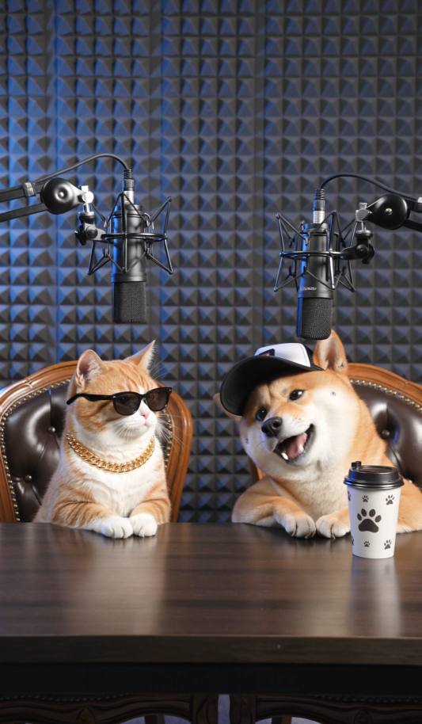 | 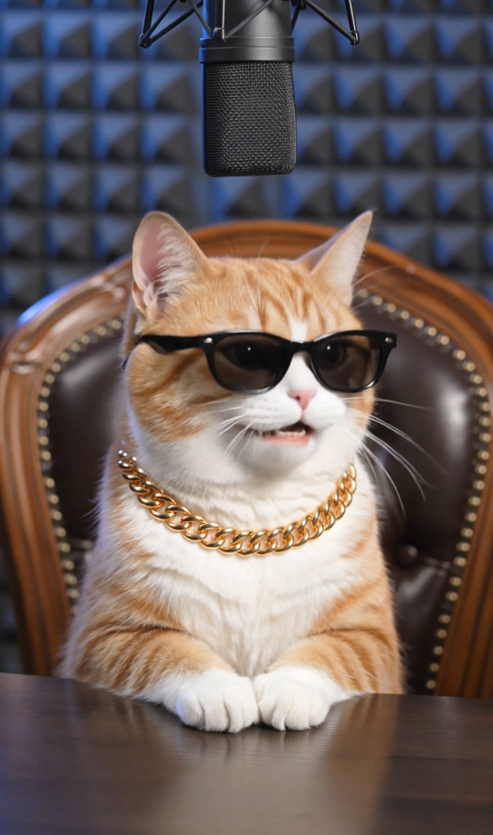 | 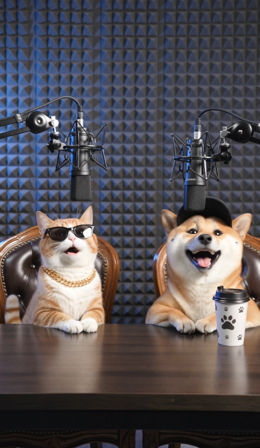 |

**Output:**

https://github.com/user-attachments/assets/a20adca0-bf45-4cae-b933-c98b86eac8d0

---

### Case 2: Pixar style — the eureka moment

**Model:** `happyhorse-1.0-r2v`

> **Prompt intent (EN annotation):** Fully English. Demonstrates the canonical R2V pattern of binding storyboard panels to camera beats. Each `[Image N]` tag is a key pose: `[Image 1]` = setup at the desk, `[Image 2]` = puzzled close-up, `[Image 3]` = the lightbulb smile, `[Image 4]` = relaxed feet-on-desk pose. Lever: the orbiting camera move that connects the four key frames into one continuous beat — `the camera orbits` … `mid-orbit, the camera cuts to a close-up` … `then continues its orbiting movement`.

**Prompt (verbatim):**
```
Generate a Pixar-style video. The camera orbits around a girl sitting at her desk. She is seated in front of her computer, deep in thought [Image 1]. Mid-orbit, the camera cuts to a close-up of her face [Image 2], her expression conveying utter puzzlement. Suddenly, her eyes light up and her face instantly relaxes into a delighted smile [Image 3], showing that she has just struck upon a brilliant idea. The camera then continues its orbiting movement as, having found her answer, the girl cheerfully kicks her feet up onto the desk and leans back with her hands clasped behind her head [Image 4], radiating a state of pure joy and relaxation.
```

**Reference images:**

| Reference 1 | Reference 2 | Reference 3 | Reference 4 |
|:---:|:---:|:---:|:---:|
|  | 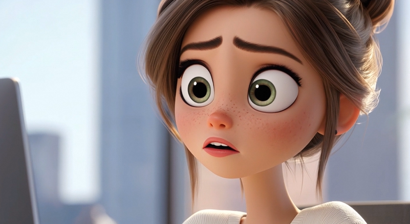 | 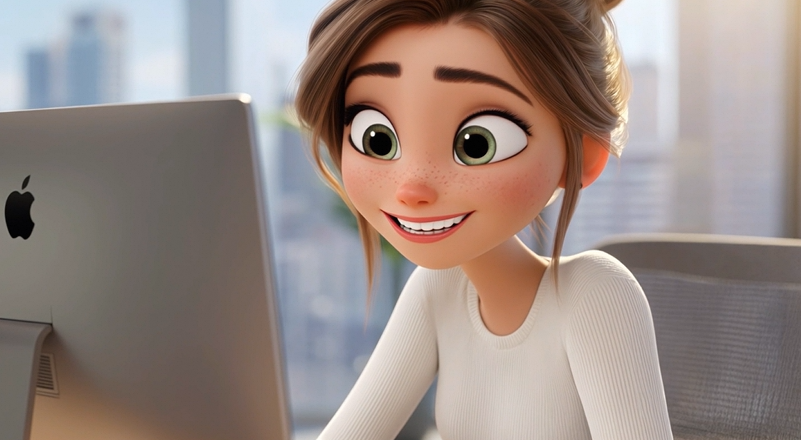 |  |

**Output:**

https://github.com/user-attachments/assets/0406df65-6330-43f4-9e1d-7bb82acffda2

---

### Case 3: Period-drama two-character interaction — Prince and the maid

**Model:** `happyhorse-1.0-r2v`

> **Prompt intent (EN annotation):** A two-image-binding pattern. `「image 1」` = the prince (calm, focused, holding a scroll); `「image 2」` = the maid in pale-green sheer robes, sneaking up at an angle. Levers: explicit per-character action assignment, the verbatim teasing exchange (`王爷不近女色？` / `嗯`), the `固定机位` static-camera lock, and the look stack (`真人古风写真风格，电影级光影质感，面部细节清晰`). Same dialogue as the I2V Case 1 — useful as a side-by-side benchmark of I2V vs R2V handling for the same scene.

**Prompt (verbatim):**
```
参考「image 1」中的王爷形象与「image 2」中的丫头形象，两人在古风书房场景中互动。「image 1」端坐案前执卷看书，神情清冷专注。「image 2」身着浅绿纱衣从旁侧悄悄凑近，歪头凝视「image 1」侧脸，眼神试探又带俏皮。一个清脆俏皮的女声问："王爷不近女色？"一个低沉冷淡的男声回："嗯"。暖光透过窗棂洒落，固定机位，真人古风写真风格，电影级光影质感，面部细节清晰。
```

**Reference images:**

| Reference 1 | Reference 2 |
|:---:|:---:|
|  |  |

**Output:**

https://github.com/user-attachments/assets/a476afe6-43fa-4ead-ab8a-37a90fd50ab4

---

### Case 4: Period-drama youth dialogue — four-panel storyboard

**Model:** `happyhorse-1.0-r2v`

> **Prompt intent (EN annotation):** Four-panel storyboard pattern with explicit shot type, length and angle for each beat (`分镜1（近景3秒）侧面跟拍`, `分镜2（中景4秒）平视`, `分镜3（近景3秒）平视`, `分镜4（中景5秒）正面平视`). Levers: `image 1` / `image 2` / `image 3` triple-binding (boy / girl / scene), the four verbatim dialogue lines that drive each shot's emotion, and the global look directives (`电影质感，智能分镜，动作流畅自然，画面无崩坏`). Useful template for any banter-driven character piece.

**Prompt (verbatim):**
```
电影质感，智能分镜，动作流畅自然，画面无崩坏。分镜1（近景3秒）侧面跟拍「image 3」。两人起身行走，少女「image 2」突然停下脚步翻了个白眼，无情拆台说："就我们？别人早都跑没了影。"分镜2（中景4秒）平视。少年「image 1」凑近半步，压低声音提议说到："要不咱直接撂挑子跑路归隐？"分镜3（近景3秒）平视。少女抬手戳了戳他的胳膊，一脸无语回怼说："跑？哪能这么便宜了他们？"分镜4（中景5秒）正面平视。少年瞬间蔫了，少女绷着脸补刀回应说："收收你的垮脸，组织监控正对着咱呢"
```

**Reference images:**

| Reference 1 | Reference 2 | Reference 3 |
|:---:|:---:|:---:|
| 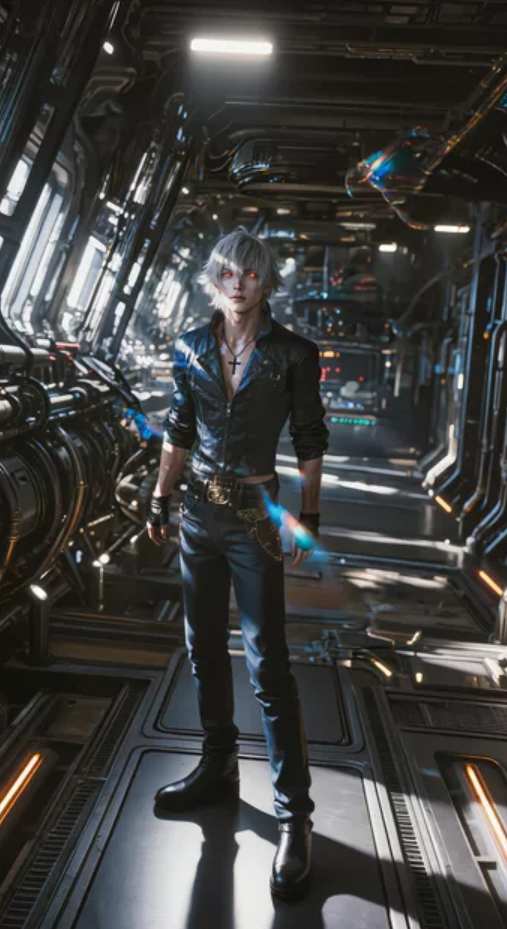 | 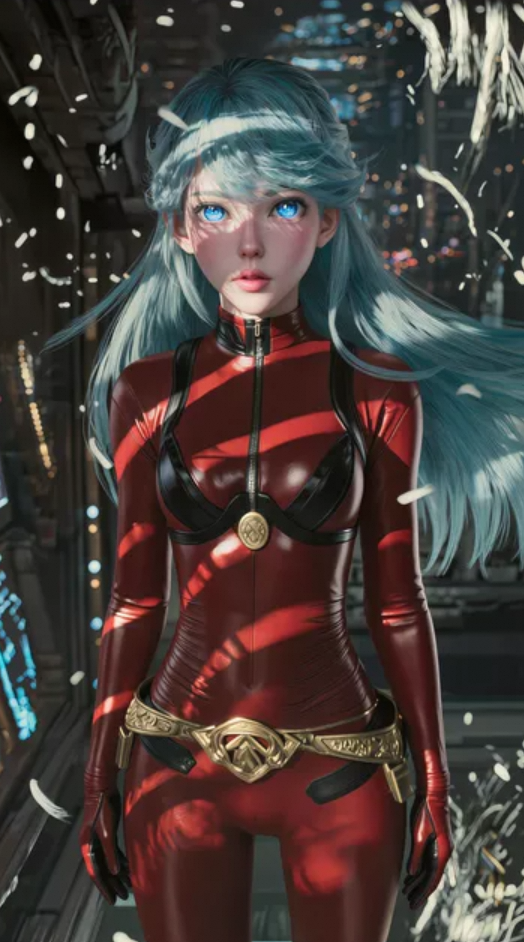 | 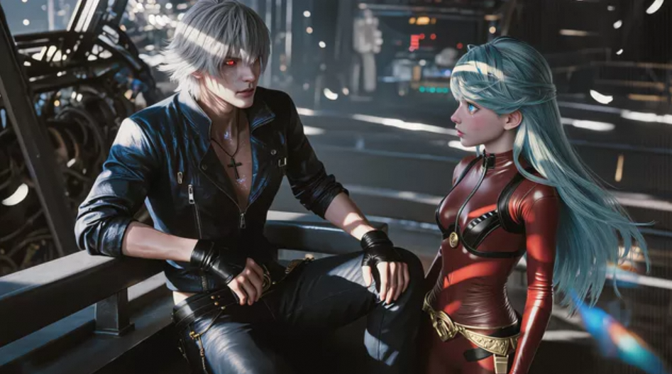 |

**Output:**

https://github.com/user-attachments/assets/a2869803-6a41-48a4-8995-6795a19ebd9a

---

### Case 5: K-drama-style convenience store — rainy healing night

**Model:** `happyhorse-1.0-r2v`

> **Prompt intent (EN annotation):** A four-image walkthrough piece — `image 1` = exterior establishing, `image 2` = girl at the hot-drink case, `image 3` = clerk-girl exchange, `image 4` = girl at the doorway with the drink. Levers: the global tone declaration (`韩漫风格、电影感`, `情绪安静、治愈、微孤独、温柔`), per-shot emotional progression (tired → softening → quietly comforted → calm), and one verbatim Korean line (`오늘도 수고 많았어요.`) kept as-is — translating it would erase the cultural setting that defines the genre. Useful template for any "ambient-mood vignette across multiple locations" piece.

**Prompt (verbatim):**
```
生成一段韩漫风格、电影感的短视频。夜晚，雨夜便利店，灯光柔和，情绪安静、治愈、微孤独、温柔。开场镜头展示深夜街角的便利店外景，暖白灯光从玻璃窗透出，外面下着细雨，地面有潮湿反光，街灯和夜色安静而柔和「image 1」。然后镜头切入店内，年轻女生推门进入便利店，她穿着长外套，头发和肩头带着些许雨水，神情疲惫但温柔。她慢慢走到热饮柜前停下，在暖橙色灯光映照下轻轻发呆，呼吸放缓，侧脸显得安静而落寞「image 2」。接着镜头转向收银台，夜班店员少年注意到她，视线在她湿润的发梢和疲惫的神情上短暂停留，眼神里浮现一丝关心。他抬起头，对她露出温和而克制的微笑，轻声说："오늘도 수고 많았어요." 女生听见后微微一怔，缓慢转头看向他，眼神从空茫变得柔软。两人短暂对视，空气安静却温暖。她轻轻弯起嘴角，露出一个很浅、很克制的笑，随后拿起一罐热饮，手指握住饮料罐时像是终于放松下来。店员保持温柔的神情看着她，她则带着一点腼腆与被安慰到的情绪，轻轻点头回应「image 3」。最后镜头缓慢收束到便利店门口，女生双手捧着热饮站在门边，看向外面的雨夜街道，便利店暖光勾勒她的背影，雨丝和街灯在背景中柔和闪烁。她的神情平静下来，眼底带着若有若无的笑意，画面停留在安静、温柔、细腻治愈的情绪中结束「image 4」。
```

**Reference images:**

| Reference 1 | Reference 2 | Reference 3 | Reference 4 |
|:---:|:---:|:---:|:---:|
| 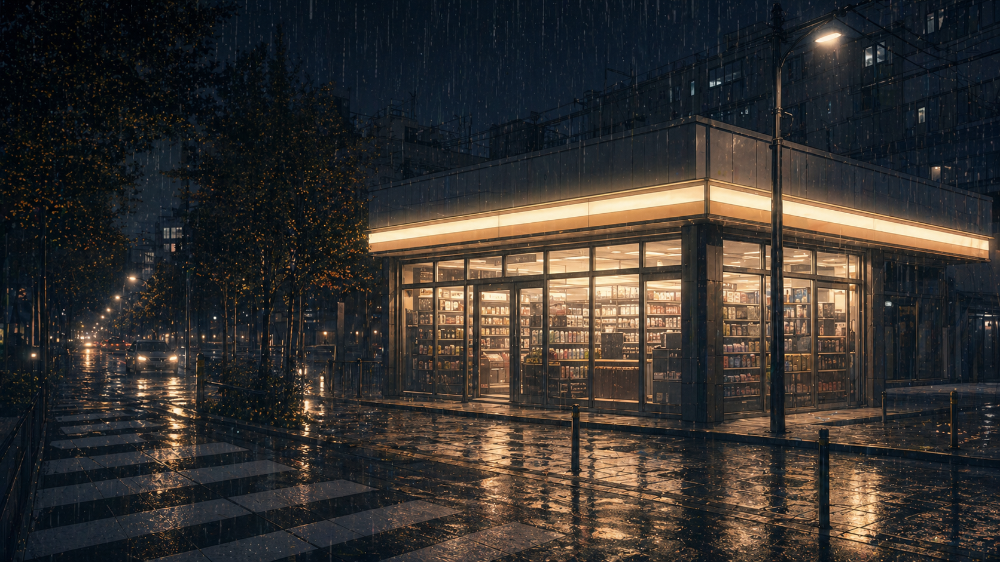 | 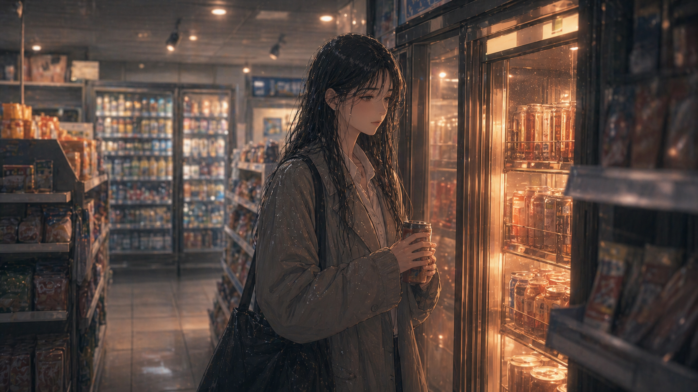 | 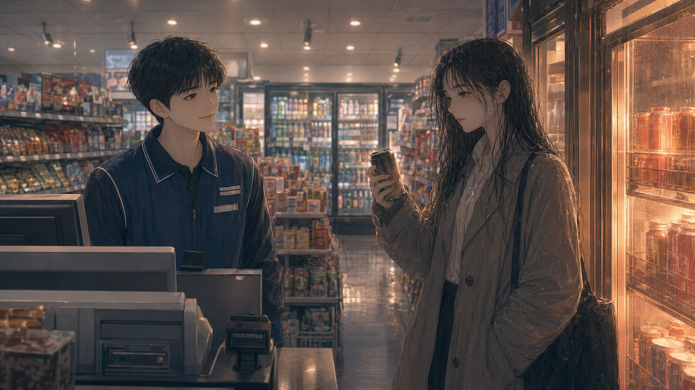 | 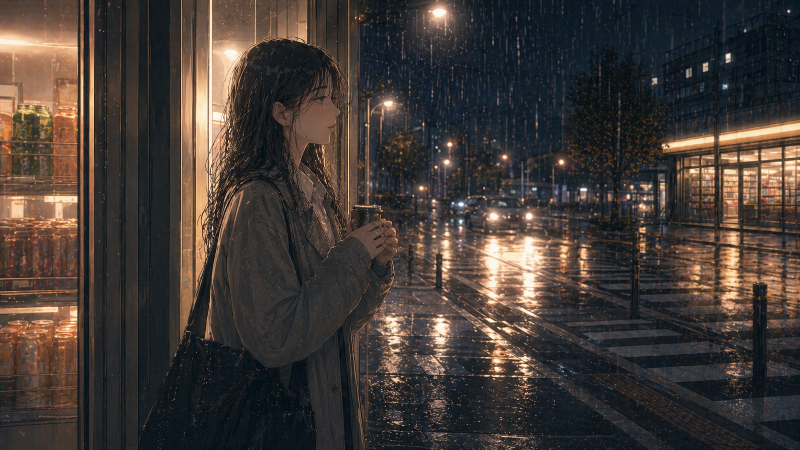 |

**Output:**

https://github.com/user-attachments/assets/3669f31b-8c82-482b-9781-1852a260ffd2
