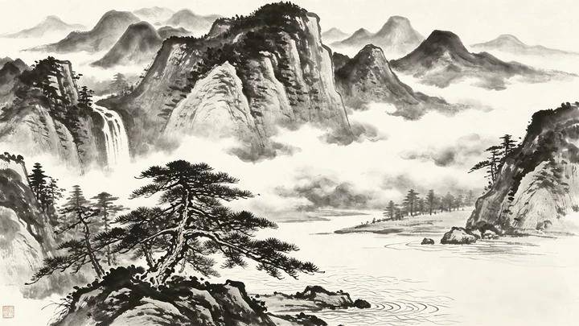
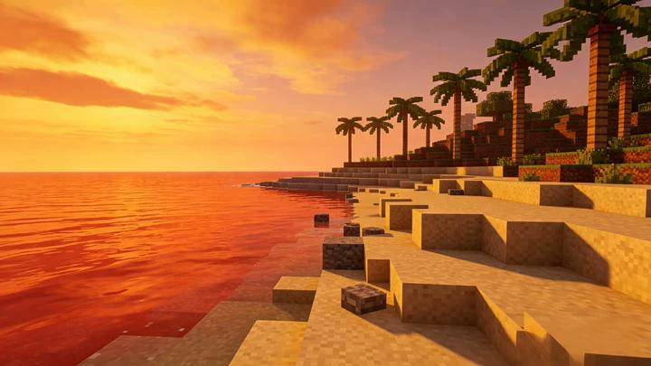
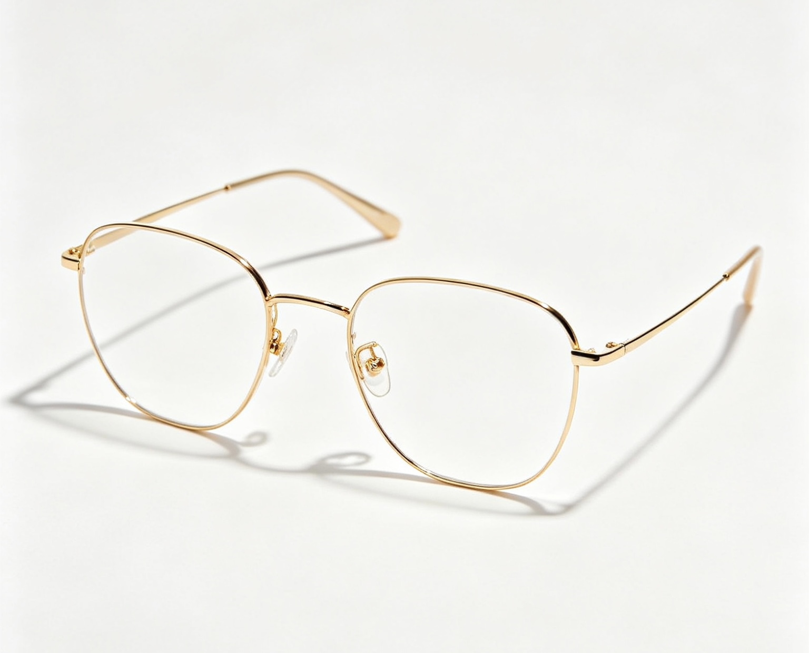

# Video Edit (Style Transfer / Element Replacement) Cases

🌐 **Language:** English · [🇨🇳 中文](video-edit.md)
>
> AI-powered video editing on existing footage — no full regeneration needed. Drive edits with text prompts alone, or pair them with reference images for visual guidance. The two modes can be mixed freely.

**When to use:**
- The original video's overall style or mood is wrong (photoreal → anime, daytime → dusk).
- A localized element needs swapping (background, garment color, weather FX).
- You have a target-style reference image and want the whole video to drift toward it.
- A specific object in the video should be replaced with a specific object from a reference image.
- You want to make targeted fixes to an AI-generated clip — tweak motion or polish frame-level details.

**Authoring tip:** State both **what to change** and **what to keep**. The more concrete you are, the more surgical the edit, and the less risk of collateral changes to areas that should stay untouched.

---

### Case 1: Costume swap — misty-blue Ming-dynasty hanfu

**Model:** `happyhorse-1.0-video-edit`

**Prompt intent (EN annotation):**
- Garment replacement keyed to a still reference; the clothing has to track body shape, sleeve flutter, and collar layering as the actor moves.
- Embroidery (cranes + florals) must match the reference's position, scale, and detail; surface highlights and shadows must respect the source video's lighting.
- Hard "preserve 100%" lock on face, hair, skin, background, and camera move — preventing the model from drifting on anything outside the garment.

**Prompt:**
```
参考 Image 1，将视频中女主的衣服替换为图中所示的雾霾蓝明制汉服。汉服必须完全贴合女主的身形轮廓和动作姿态，宽大的袖子需跟随她的手臂运动自然摆动，立领和衣襟的层次感要随身体转动合理呈现。仙鹤与花卉刺绣的图案位置、比例和细节必须严格参照 Image 1，刺绣表面的光泽、阴影和材质质感必须与原视频环境的光源保持一致。在此过程中，女主的面部表情、发型、肤色、背景环境以及镜头的运镜轨迹必须保持 100% 不变。
```

**Inputs:**

| Reference image |
|:---:|
|  |

**Source video:**

https://github.com/user-attachments/assets/a43226c7-9592-4943-911d-8f88ae0f39cb

**Output:**

https://github.com/user-attachments/assets/630e2fdf-e069-4e2c-9392-d0217d8b0ade

---

### Case 2: Element replacement — white cruise ship → spaceship

**Model:** `happyhorse-1.0-video-edit`

**Prompt intent (EN annotation):**
- Object swap that must inherit the original subject's trajectory, speed, and orientation — no free-floating motion.
- Lighting, reflections, and shadows on the new object must match the source environment's light direction and intensity.
- Background (water, sky) and camera path locked at 100% to keep the swap surgical.

**Prompt:**
```
参考 Image 1，将视频中正在行驶的白色邮轮替换为图中所示的太空飞船。飞船必须完全遵循原邮轮的行驶轨迹、速度和朝向，严丝合缝地嵌入场景中。确保飞船表面的光照、反射和阴影与原视频环境的光源保持一致。在替换过程中，周围的背景、水面、天空以及镜头的运镜轨迹必须保持 100% 不变。
```

**Inputs:**

| Reference image |
|:---:|
|  |

**Source video:**

https://github.com/user-attachments/assets/125d1f81-c654-490c-aeec-97b986ba7b5b

**Output:**

https://github.com/user-attachments/assets/ee135e9b-31c7-4821-9e8d-fd790f6c260d

---

### Case 3: Ink-wash style transfer

**Model:** `happyhorse-1.0-video-edit`

**Prompt intent (EN annotation):**
- Whole-clip stylization — every pictorial element (mountains, mist, buildings) recast as ink brushwork with tonal gradation.
- "Camera path and scene structure unchanged" preserves geometric coherence so the stylization reads as a paint-over rather than a re-imagined scene.
- Reference image supplies the visual anchor for what the target ink aesthetic should look like.

**Prompt:**
```
参考Image 1中的视觉特征，将视频整体风格转化为传统黑白水墨画风格，把画面中的山脉、雾气、建筑等所有元素全部重塑为具有墨色浓淡变化的写意笔触，在保留原视频运镜轨迹与场景结构完全不变的同时，呈现出一种黑白分明、意境深远的中国水墨视觉效果。
```

**Inputs:**

| Reference image |
|:---:|
|  |

**Source video:**

https://github.com/user-attachments/assets/2d2bd61f-bf6e-486e-ab52-a87b8f413d80

**Output:**

https://github.com/user-attachments/assets/c883624e-dd80-4326-bffa-dbeeab30341b

---

### Case 4: Cyberpunk style transfer

**Model:** `happyhorse-1.0-video-edit`

**Prompt intent (EN annotation):**
- Minimalism stress test — a single English sentence with no reference image, no preserve clauses, no list of elements.
- Useful as a baseline to compare against the long-form ink-wash prompt: when does brevity work, when does it over-edit?

**Prompt:**
```
Transform the city into a cyberpunk style.
```

**Source video:**

https://github.com/user-attachments/assets/ee2e4292-a85c-4c68-8950-23cf2780c297

**Output:**

https://github.com/user-attachments/assets/30ea0ef0-b2ac-462e-ac59-adcfbf5244c1

---

### Case 5: Minecraft voxel style transfer

**Model:** `happyhorse-1.0-video-edit`

**Prompt intent (EN annotation):**
- English-language full stylization — convert subjects, characters, and environment into 3D blocks with low-resolution pixelated textures.
- Lighting and palette tied to the reference image's blocky world look.
- Movement, character actions, and camera tracking pinned at 100% so the result reads as the same scene rebuilt inside Minecraft.

**Prompt:**
```
Transform the entire video into the Minecraft voxel style based on the visual aesthetic of Image 1. Convert all subjects, characters, and the environment into 3D blocks with low-resolution pixelated textures. Ensure the lighting and colors match the blocky world shown in Image 1. Throughout this transformation, the original movements, character actions, and camera tracking path must remain 100% unchanged. The final result should look like the original scene has been completely rebuilt inside the Minecraft game world.
```

**Inputs:**

| Reference image |
|:---:|
|  |

**Source video:**

https://github.com/user-attachments/assets/eb03e303-ec49-4bfe-ae79-7b65111f4119

**Output:**

https://github.com/user-attachments/assets/b1e7e3a0-1f8f-45c1-8422-492ae684633c

---

### Case 6: Cat swaps glasses + dances to music

**Model:** `happyhorse-1.0-video-edit`

**Prompt intent (EN annotation):**
- Compound edit: object swap (black frames → gold frames) PLUS motion injection (rhythmic head/body sway).
- Eyewear must stay locked to the cat's face through all the new movement — common failure mode is glasses drifting off.
- Breed appearance, background, and camera path all pinned at 100%.

**Prompt:**
```
将视频中猫戴的黑框眼镜替换为参考图中的金丝框眼镜。同时修改猫的动态，让它随着动感的音乐节奏有节奏地左右摇摆头部和身体，呈现出一种在听音乐跳舞的视觉效果。摇摆动作应丝滑、富有活力且富有韵律感。在此过程中，必须保持猫的品种外观、背景环境以及镜头的运镜轨迹100%不变。确保金丝眼镜在猫摇摆时始终精准地贴合在它的脸上，并随其头部动作自然移动。
```

**Inputs:**

| Reference image |
|:---:|
|  |

**Source video:**

https://github.com/user-attachments/assets/cc472bfa-9f0a-4aff-a334-c79d1c5d935e

**Output:**

https://github.com/user-attachments/assets/9b57f2de-7e1c-47ae-afa3-0c2bdd639b40

---

## Video-edit authoring tips

- Always pair "what to change" with an explicit "what to keep at 100%" clause — the model uses both lists to scope the edit.
- For object swaps, repeat motion attributes the new object must inherit (trajectory, speed, orientation, contact points).
- For style transfers, name the elements that should be re-skinned (mountains, mist, buildings…) so nothing gets accidentally left in the original style.
- A reference image plus a written description tends to outperform either one alone for material/texture-heavy edits (embroidery, voxel, ink).
- Compound edits (Case 6) work best when each sub-edit is a separate sentence with its own preservation clause.
